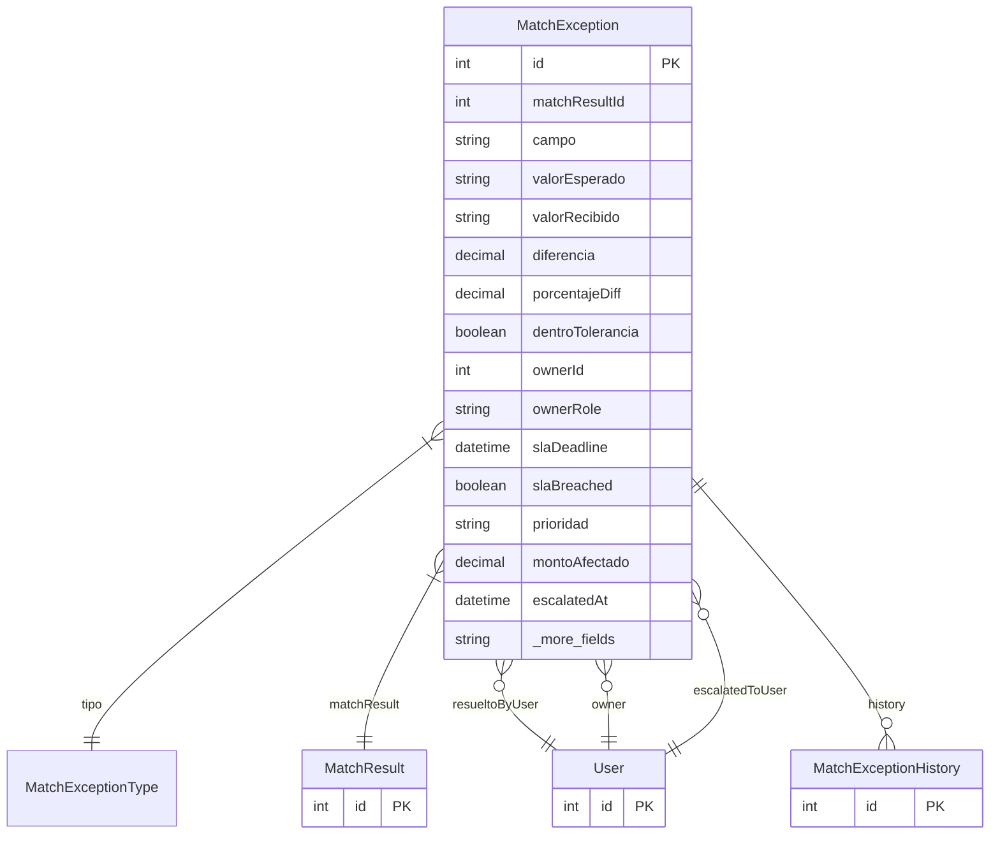

# MatchException

> Table name: `match_exceptions`

**Schema location:** Lines 6991-7034

## Fields

| Field | Type | Required | Unique | Default | Notes |
|-------|------|----------|--------|---------|-------|
| `id` | `Int` | ✅ | 🔑 PK | `autoincrement(` |  |
| `matchResultId` | `Int` | ✅ |  | `` |  |
| `campo` | `String` | ✅ |  | `` | DB: VarChar(100) |
| `valorEsperado` | `String?` | ❌ |  | `` |  |
| `valorRecibido` | `String?` | ❌ |  | `` |  |
| `diferencia` | `Decimal?` | ❌ |  | `` | DB: Decimal(15, 4) |
| `porcentajeDiff` | `Decimal?` | ❌ |  | `` | DB: Decimal(5, 2) |
| `dentroTolerancia` | `Boolean` | ✅ |  | `false` |  |
| `ownerId` | `Int?` | ❌ |  | `` | Owner y SLA |
| `ownerRole` | `String?` | ❌ |  | `` | DB: VarChar(50) |
| `slaDeadline` | `DateTime?` | ❌ |  | `` |  |
| `slaBreached` | `Boolean` | ✅ |  | `false` |  |
| `prioridad` | `String?` | ❌ |  | `` | DB: VarChar(20). BAJA, NORMAL, ALTA, URGENTE |
| `montoAfectado` | `Decimal?` | ❌ |  | `` | DB: Decimal(15, 2) |
| `escalatedAt` | `DateTime?` | ❌ |  | `` | Escalamiento |
| `escalatedTo` | `Int?` | ❌ |  | `` |  |
| `resuelto` | `Boolean` | ✅ |  | `false` | Resolución |
| `resueltoPor` | `Int?` | ❌ |  | `` |  |
| `resueltoAt` | `DateTime?` | ❌ |  | `` |  |
| `accion` | `String?` | ❌ |  | `` |  |
| `reasonCode` | `String?` | ❌ |  | `` | DB: VarChar(50) |
| `reasonText` | `String?` | ❌ |  | `` |  |
| `notas` | `String?` | ❌ |  | `` |  |
| `createdAt` | `DateTime` | ✅ |  | `now(` |  |

## Relations

| Field | Type | Cardinality | FK Fields | References | On Delete |
|-------|------|-------------|-----------|------------|-----------|
| `tipo` | [MatchExceptionType](./models/MatchExceptionType.md) | Many-to-One | - | - | - |
| `matchResult` | [MatchResult](./models/MatchResult.md) | Many-to-One | matchResultId | id | Cascade |
| `resueltoByUser` | [User](./models/User.md) | Many-to-One (optional) | resueltoPor | id | - |
| `owner` | [User](./models/User.md) | Many-to-One (optional) | ownerId | id | - |
| `escalatedToUser` | [User](./models/User.md) | Many-to-One (optional) | escalatedTo | id | - |
| `history` | [MatchExceptionHistory](./models/MatchExceptionHistory.md) | One-to-Many | - | - | - |

## Referenced By

| Model | Field | Cardinality |
|-------|-------|-------------|
| [User](./models/User.md) | `matchExceptionsResolved` | Has many |
| [User](./models/User.md) | `matchExceptionsOwned` | Has many |
| [User](./models/User.md) | `matchExceptionsEscalated` | Has many |
| [MatchResult](./models/MatchResult.md) | `exceptions` | Has many |
| [MatchExceptionHistory](./models/MatchExceptionHistory.md) | `exception` | Has one |

## Indexes

- `matchResultId`
- `tipo`
- `resuelto`
- `ownerId`
- `slaDeadline`
- `slaBreached`

## Entity Diagram

