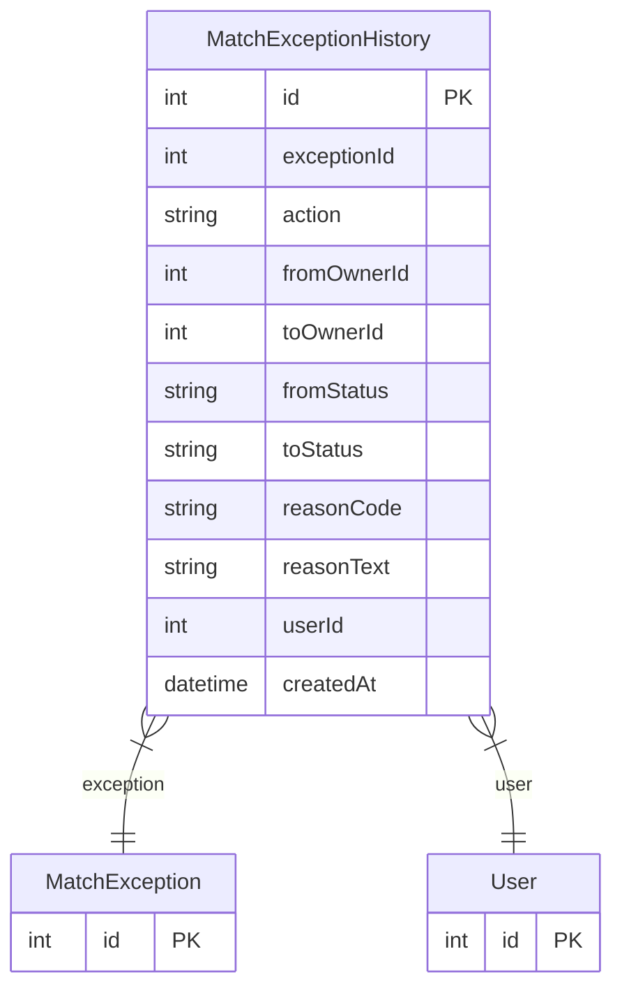

# MatchExceptionHistory

> Table name: `match_exception_history`

**Schema location:** Lines 7123-7141

## Fields

| Field | Type | Required | Unique | Default | Notes |
|-------|------|----------|--------|---------|-------|
| `id` | `Int` | ✅ | 🔑 PK | `autoincrement(` |  |
| `exceptionId` | `Int` | ✅ |  | `` |  |
| `action` | `String` | ✅ |  | `` | DB: VarChar(50). ASSIGN, ESCALATE, RESOLVE, COMMENT |
| `fromOwnerId` | `Int?` | ❌ |  | `` |  |
| `toOwnerId` | `Int?` | ❌ |  | `` |  |
| `fromStatus` | `String?` | ❌ |  | `` | DB: VarChar(50) |
| `toStatus` | `String?` | ❌ |  | `` | DB: VarChar(50) |
| `reasonCode` | `String?` | ❌ |  | `` | DB: VarChar(50) |
| `reasonText` | `String?` | ❌ |  | `` |  |
| `userId` | `Int` | ✅ |  | `` | Quien realizó la acción |
| `createdAt` | `DateTime` | ✅ |  | `now(` |  |

## Relations

| Field | Type | Cardinality | FK Fields | References | On Delete |
|-------|------|-------------|-----------|------------|-----------|
| `exception` | [MatchException](./models/MatchException.md) | Many-to-One | exceptionId | id | Cascade |
| `user` | [User](./models/User.md) | Many-to-One | userId | id | - |

## Referenced By

| Model | Field | Cardinality |
|-------|-------|-------------|
| [User](./models/User.md) | `matchExceptionHistory` | Has many |
| [MatchException](./models/MatchException.md) | `history` | Has many |

## Indexes

- `exceptionId`

## Entity Diagram

