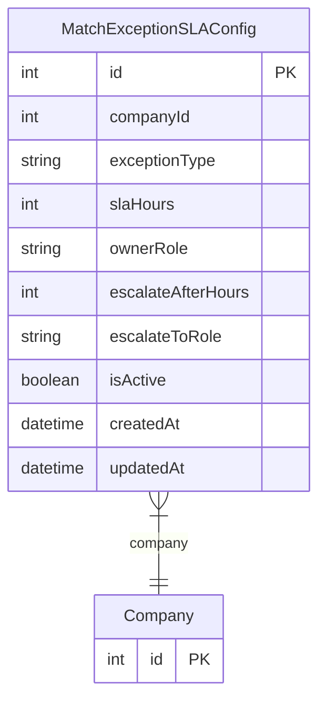

# MatchExceptionSLAConfig

> Table name: `match_exception_sla_configs`

**Schema location:** Lines 7102-7118

## Fields

| Field | Type | Required | Unique | Default | Notes |
|-------|------|----------|--------|---------|-------|
| `id` | `Int` | ✅ | 🔑 PK | `autoincrement(` |  |
| `companyId` | `Int` | ✅ |  | `` |  |
| `exceptionType` | `String` | ✅ |  | `` | DB: VarChar(50). PRECIO_DIFERENTE, CANTIDAD_DIFERENTE, etc |
| `slaHours` | `Int` | ✅ |  | `24` |  |
| `ownerRole` | `String?` | ❌ |  | `` | DB: VarChar(50). Rol responsable por defecto |
| `escalateAfterHours` | `Int?` | ❌ |  | `` | Horas antes de escalar |
| `escalateToRole` | `String?` | ❌ |  | `` | DB: VarChar(50). Rol para escalamiento |
| `isActive` | `Boolean` | ✅ |  | `true` |  |
| `createdAt` | `DateTime` | ✅ |  | `now(` |  |
| `updatedAt` | `DateTime` | ✅ |  | `` |  |

## Relations

| Field | Type | Cardinality | FK Fields | References | On Delete |
|-------|------|-------------|-----------|------------|-----------|
| `company` | [Company](./models/Company.md) | Many-to-One | companyId | id | Cascade |

## Referenced By

| Model | Field | Cardinality |
|-------|-------|-------------|
| [Company](./models/Company.md) | `matchExceptionSLAConfigs` | Has many |

## Unique Constraints

- `companyId, exceptionType`

## Entity Diagram

