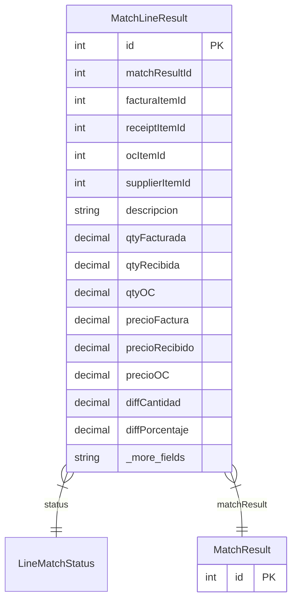

# MatchLineResult

> Table name: `match_line_results`

**Schema location:** Lines 6953-6989

## Fields

| Field | Type | Required | Unique | Default | Notes |
|-------|------|----------|--------|---------|-------|
| `id` | `Int` | ✅ | 🔑 PK | `autoincrement(` |  |
| `matchResultId` | `Int` | ✅ |  | `` |  |
| `facturaItemId` | `Int?` | ❌ |  | `` | Item de la factura |
| `receiptItemId` | `Int?` | ❌ |  | `` | Item del remito (puede ser null si falta) |
| `ocItemId` | `Int?` | ❌ |  | `` | Item de la OC |
| `supplierItemId` | `Int?` | ❌ |  | `` | Para mapeo robusto |
| `descripcion` | `String` | ✅ |  | `` | Para items sin supplierItemId |
| `qtyFacturada` | `Decimal` | ✅ |  | `` | DB: Decimal(15, 4). Cantidades comparadas |
| `qtyRecibida` | `Decimal` | ✅ |  | `` | DB: Decimal(15, 4) |
| `qtyOC` | `Decimal?` | ❌ |  | `` | DB: Decimal(15, 4) |
| `precioFactura` | `Decimal?` | ❌ |  | `` | DB: Decimal(15, 4). Precios comparados |
| `precioRecibido` | `Decimal?` | ❌ |  | `` | DB: Decimal(15, 4) |
| `precioOC` | `Decimal?` | ❌ |  | `` | DB: Decimal(15, 4) |
| `diffCantidad` | `Decimal?` | ❌ |  | `` | DB: Decimal(15, 4). Diferencia absoluta |
| `diffPorcentaje` | `Decimal?` | ❌ |  | `` | DB: Decimal(5, 2). % de diferencia de cantidad |
| `diffPrecio` | `Decimal?` | ❌ |  | `` | DB: Decimal(15, 4). Diferencia absoluta de precio |
| `pctVarianzaPrecio` | `Decimal?` | ❌ |  | `` | DB: Decimal(5, 2). % de varianza de precio |
| `razon` | `String?` | ❌ |  | `` | "Faltante", "Exceso", "Precio diferente", etc. |
| `createdAt` | `DateTime` | ✅ |  | `now(` |  |

## Relations

| Field | Type | Cardinality | FK Fields | References | On Delete |
|-------|------|-------------|-----------|------------|-----------|
| `status` | [LineMatchStatus](./models/LineMatchStatus.md) | Many-to-One | - | - | - |
| `matchResult` | [MatchResult](./models/MatchResult.md) | Many-to-One | matchResultId | id | Cascade |

## Referenced By

| Model | Field | Cardinality |
|-------|-------|-------------|
| [MatchResult](./models/MatchResult.md) | `lineResults` | Has many |

## Indexes

- `matchResultId`
- `status`

## Entity Diagram

