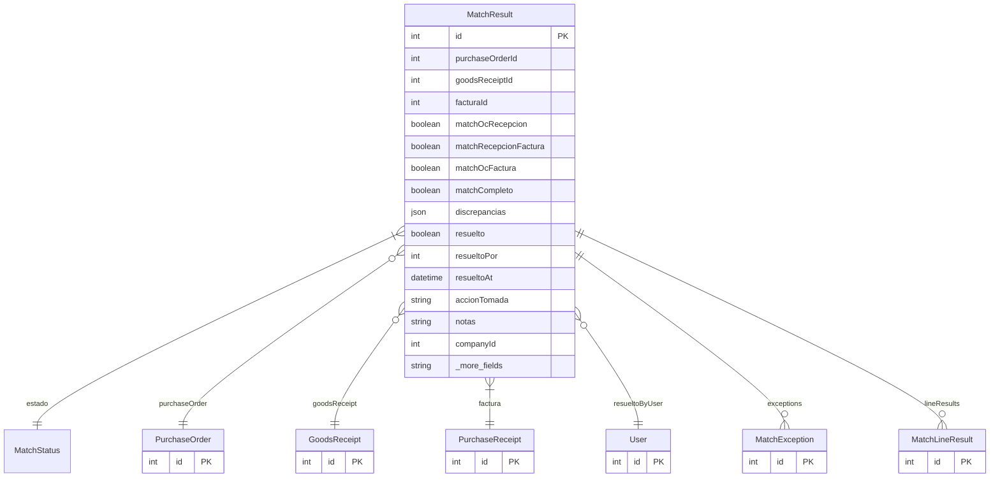

# MatchResult

> Table name: `match_results`

**Schema location:** Lines 6915-6950

## Fields

| Field | Type | Required | Unique | Default | Notes |
|-------|------|----------|--------|---------|-------|
| `id` | `Int` | ✅ | 🔑 PK | `autoincrement(` |  |
| `purchaseOrderId` | `Int?` | ❌ |  | `` |  |
| `goodsReceiptId` | `Int?` | ❌ |  | `` |  |
| `facturaId` | `Int` | ✅ |  | `` |  |
| `matchOcRecepcion` | `Boolean?` | ❌ |  | `` | Resultados del match |
| `matchRecepcionFactura` | `Boolean?` | ❌ |  | `` |  |
| `matchOcFactura` | `Boolean?` | ❌ |  | `` |  |
| `matchCompleto` | `Boolean` | ✅ |  | `false` |  |
| `discrepancias` | `Json?` | ❌ |  | `` | Array de discrepancias encontradas |
| `resuelto` | `Boolean` | ✅ |  | `false` | Resolución |
| `resueltoPor` | `Int?` | ❌ |  | `` |  |
| `resueltoAt` | `DateTime?` | ❌ |  | `` |  |
| `accionTomada` | `String?` | ❌ |  | `` |  |
| `notas` | `String?` | ❌ |  | `` |  |
| `companyId` | `Int` | ✅ |  | `` | Tracking |
| `createdAt` | `DateTime` | ✅ |  | `now(` |  |
| `updatedAt` | `DateTime` | ✅ |  | `` |  |

## Relations

| Field | Type | Cardinality | FK Fields | References | On Delete |
|-------|------|-------------|-----------|------------|-----------|
| `estado` | [MatchStatus](./models/MatchStatus.md) | Many-to-One | - | - | - |
| `purchaseOrder` | [PurchaseOrder](./models/PurchaseOrder.md) | Many-to-One (optional) | purchaseOrderId | id | - |
| `goodsReceipt` | [GoodsReceipt](./models/GoodsReceipt.md) | Many-to-One (optional) | goodsReceiptId | id | - |
| `factura` | [PurchaseReceipt](./models/PurchaseReceipt.md) | Many-to-One | facturaId | id | - |
| `resueltoByUser` | [User](./models/User.md) | Many-to-One (optional) | resueltoPor | id | - |
| `exceptions` | [MatchException](./models/MatchException.md) | One-to-Many | - | - | - |
| `lineResults` | [MatchLineResult](./models/MatchLineResult.md) | One-to-Many | - | - | - |

## Referenced By

| Model | Field | Cardinality |
|-------|-------|-------------|
| [User](./models/User.md) | `matchResultsResolved` | Has many |
| [PurchaseReceipt](./models/PurchaseReceipt.md) | `matchResults` | Has many |
| [PurchaseOrder](./models/PurchaseOrder.md) | `matchResults` | Has many |
| [GoodsReceipt](./models/GoodsReceipt.md) | `matchResults` | Has many |
| [MatchLineResult](./models/MatchLineResult.md) | `matchResult` | Has one |
| [MatchException](./models/MatchException.md) | `matchResult` | Has one |

## Indexes

- `companyId`
- `estado`
- `facturaId`

## Entity Diagram

