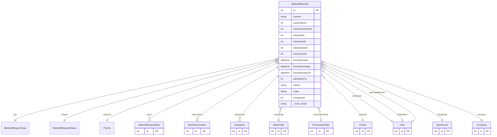

# MaterialRequest

> Table name: `material_requests`

**Schema location:** Lines 14595-14643

## Fields

| Field | Type | Required | Unique | Default | Notes |
|-------|------|----------|--------|---------|-------|
| `id` | `Int` | ✅ | 🔑 PK | `autoincrement(` |  |
| `numero` | `String` | ✅ |  | `` | DB: VarChar(50) |
| `workOrderId` | `Int?` | ❌ |  | `` | Referencias (mutuamente excluyentes según tipo) |
| `productionOrderId` | `Int?` | ❌ |  | `` |  |
| `proyectoId` | `Int?` | ❌ |  | `` |  |
| `solicitanteId` | `Int` | ✅ |  | `` |  |
| `destinatarioId` | `Int?` | ❌ |  | `` | Persona que recibirá |
| `warehouseId` | `Int?` | ❌ |  | `` | Depósito preferido (opcional) |
| `fechaSolicitud` | `DateTime` | ✅ |  | `now(` |  |
| `fechaNecesidad` | `DateTime?` | ❌ |  | `` |  |
| `fechaAprobacion` | `DateTime?` | ❌ |  | `` |  |
| `aprobadoPor` | `Int?` | ❌ |  | `` |  |
| `motivo` | `String?` | ❌ |  | `` |  |
| `notas` | `String?` | ❌ |  | `` |  |
| `companyId` | `Int` | ✅ |  | `` |  |
| `createdAt` | `DateTime` | ✅ |  | `now(` |  |
| `updatedAt` | `DateTime` | ✅ |  | `` |  |

## Relations

| Field | Type | Cardinality | FK Fields | References | On Delete |
|-------|------|-------------|-----------|------------|-----------|
| `tipo` | [MaterialRequestType](./models/MaterialRequestType.md) | Many-to-One | - | - | - |
| `estado` | [MaterialRequestStatus](./models/MaterialRequestStatus.md) | Many-to-One | - | - | - |
| `urgencia` | [Priority](./models/Priority.md) | Many-to-One | - | - | - |
| `items` | [MaterialRequestItem](./models/MaterialRequestItem.md) | One-to-Many | - | - | - |
| `reservations` | [StockReservation](./models/StockReservation.md) | One-to-Many | - | - | - |
| `despachos` | [Despacho](./models/Despacho.md) | One-to-Many | - | - | - |
| `workOrder` | [WorkOrder](./models/WorkOrder.md) | Many-to-One (optional) | workOrderId | id | - |
| `productionOrder` | [ProductionOrder](./models/ProductionOrder.md) | Many-to-One (optional) | productionOrderId | id | - |
| `proyecto` | [Project](./models/Project.md) | Many-to-One (optional) | proyectoId | id | - |
| `solicitante` | [User](./models/User.md) | Many-to-One | solicitanteId | id | - |
| `destinatario` | [User](./models/User.md) | Many-to-One (optional) | destinatarioId | id | - |
| `warehouse` | [Warehouse](./models/Warehouse.md) | Many-to-One (optional) | warehouseId | id | - |
| `aprobadoByUser` | [User](./models/User.md) | Many-to-One (optional) | aprobadoPor | id | - |
| `company` | [Company](./models/Company.md) | Many-to-One | companyId | id | Cascade |

## Referenced By

| Model | Field | Cardinality |
|-------|-------|-------------|
| [Company](./models/Company.md) | `materialRequests` | Has many |
| [User](./models/User.md) | `materialRequestsSolicitante` | Has many |
| [User](./models/User.md) | `materialRequestsDestinatario` | Has many |
| [User](./models/User.md) | `materialRequestsAprobadas` | Has many |
| [WorkOrder](./models/WorkOrder.md) | `materialRequests` | Has many |
| [Warehouse](./models/Warehouse.md) | `materialRequests` | Has many |
| [Project](./models/Project.md) | `MaterialRequest` | Has many |
| [ProductionOrder](./models/ProductionOrder.md) | `materialRequests` | Has many |
| [StockReservation](./models/StockReservation.md) | `materialRequest` | Has one |
| [MaterialRequestItem](./models/MaterialRequestItem.md) | `request` | Has one |
| [Despacho](./models/Despacho.md) | `materialRequest` | Has one |

## Indexes

- `companyId, estado`
- `workOrderId`
- `productionOrderId`
- `solicitanteId`

## Unique Constraints

- `companyId, numero`

## Entity Diagram

