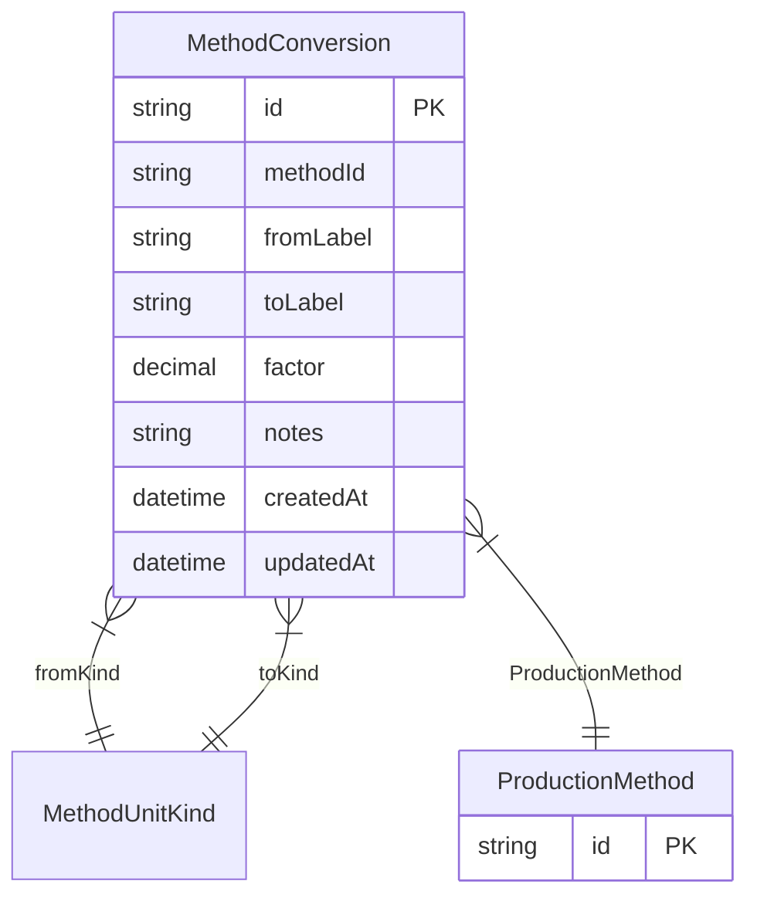

# MethodConversion

**Schema location:** Lines 3028-3040

## Fields

| Field | Type | Required | Unique | Default | Notes |
|-------|------|----------|--------|---------|-------|
| `id` | `String` | ✅ | 🔑 PK | `` |  |
| `methodId` | `String` | ✅ |  | `` |  |
| `fromLabel` | `String` | ✅ |  | `` |  |
| `toLabel` | `String` | ✅ |  | `` |  |
| `factor` | `Decimal` | ✅ |  | `` | DB: Decimal(12, 4) |
| `notes` | `String?` | ❌ |  | `` |  |
| `createdAt` | `DateTime` | ✅ |  | `now(` |  |
| `updatedAt` | `DateTime` | ✅ |  | `` |  |

## Relations

| Field | Type | Cardinality | FK Fields | References | On Delete |
|-------|------|-------------|-----------|------------|-----------|
| `fromKind` | [MethodUnitKind](./models/MethodUnitKind.md) | Many-to-One | - | - | - |
| `toKind` | [MethodUnitKind](./models/MethodUnitKind.md) | Many-to-One | - | - | - |
| `ProductionMethod` | [ProductionMethod](./models/ProductionMethod.md) | Many-to-One | methodId | id | Cascade |

## Referenced By

| Model | Field | Cardinality |
|-------|-------|-------------|
| [ProductionMethod](./models/ProductionMethod.md) | `MethodConversion` | Has many |

## Entity Diagram

