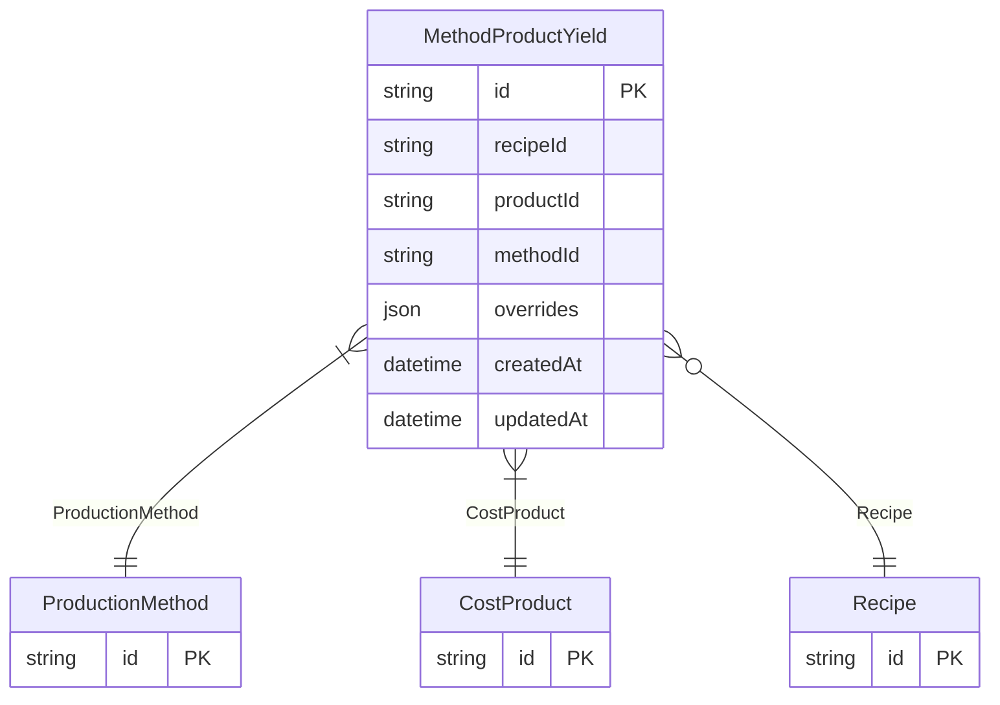

# MethodProductYield

**Schema location:** Lines 3042-3055

## Fields

| Field | Type | Required | Unique | Default | Notes |
|-------|------|----------|--------|---------|-------|
| `id` | `String` | ✅ | 🔑 PK | `` |  |
| `recipeId` | `String?` | ❌ |  | `` |  |
| `productId` | `String` | ✅ |  | `` |  |
| `methodId` | `String` | ✅ |  | `` |  |
| `overrides` | `Json?` | ❌ |  | `` |  |
| `createdAt` | `DateTime` | ✅ |  | `now(` |  |
| `updatedAt` | `DateTime` | ✅ |  | `` |  |

## Relations

| Field | Type | Cardinality | FK Fields | References | On Delete |
|-------|------|-------------|-----------|------------|-----------|
| `ProductionMethod` | [ProductionMethod](./models/ProductionMethod.md) | Many-to-One | methodId | id | Cascade |
| `CostProduct` | [CostProduct](./models/CostProduct.md) | Many-to-One | productId | id | Cascade |
| `Recipe` | [Recipe](./models/Recipe.md) | Many-to-One (optional) | recipeId | id | Cascade |

## Referenced By

| Model | Field | Cardinality |
|-------|-------|-------------|
| [CostProduct](./models/CostProduct.md) | `MethodProductYield` | Has many |
| [Recipe](./models/Recipe.md) | `MethodProductYield` | Has many |
| [ProductionMethod](./models/ProductionMethod.md) | `MethodProductYield` | Has many |

## Unique Constraints

- `productId, methodId`

## Entity Diagram

