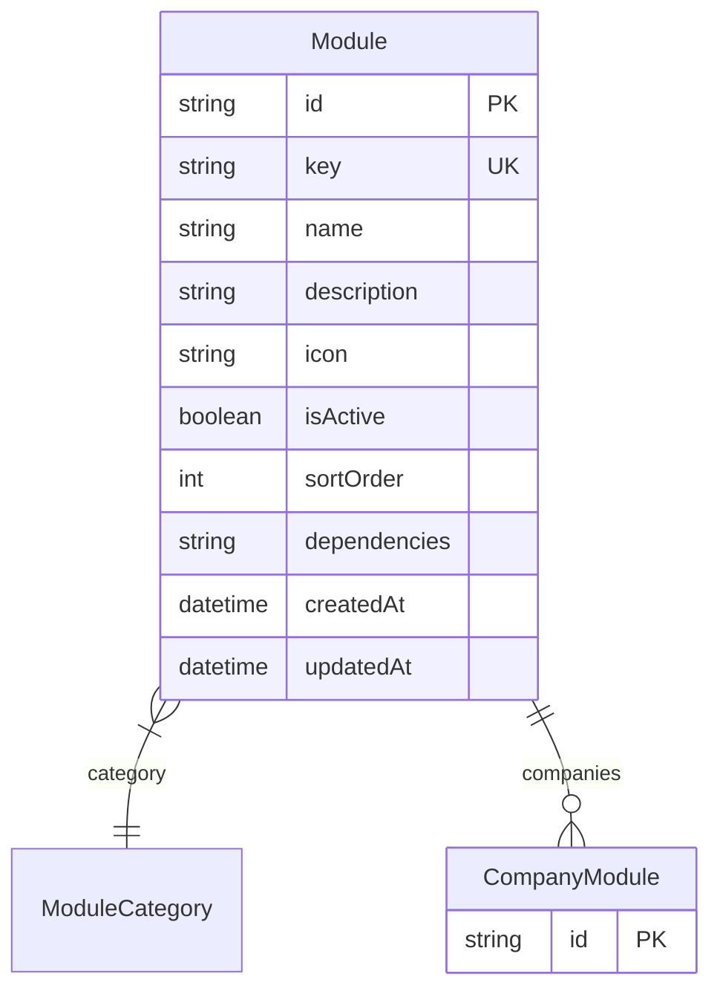

# Module

> Table name: `modules`

**Schema location:** Lines 10410-10426

## Fields

| Field | Type | Required | Unique | Default | Notes |
|-------|------|----------|--------|---------|-------|
| `id` | `String` | ✅ | 🔑 PK | `cuid(` |  |
| `key` | `String` | ✅ | ✅ | `` | "acopios", "multi_price_lists", etc. |
| `name` | `String` | ✅ |  | `` | "Sistema de Acopios" |
| `description` | `String?` | ❌ |  | `` |  |
| `icon` | `String?` | ❌ |  | `` | Icono Lucide (ej: "Package", "DollarSign") |
| `isActive` | `Boolean` | ✅ |  | `true` |  |
| `sortOrder` | `Int` | ✅ |  | `0` |  |
| `dependencies` | `String[]` | ✅ |  | `` | Keys de módulos requeridos |
| `createdAt` | `DateTime` | ✅ |  | `now(` |  |
| `updatedAt` | `DateTime` | ✅ |  | `` |  |

## Relations

| Field | Type | Cardinality | FK Fields | References | On Delete |
|-------|------|-------------|-----------|------------|-----------|
| `category` | [ModuleCategory](./models/ModuleCategory.md) | Many-to-One | - | - | - |
| `companies` | [CompanyModule](./models/CompanyModule.md) | One-to-Many | - | - | - |

## Referenced By

| Model | Field | Cardinality |
|-------|-------|-------------|
| [CompanyModule](./models/CompanyModule.md) | `module` | Has one |

## Entity Diagram

