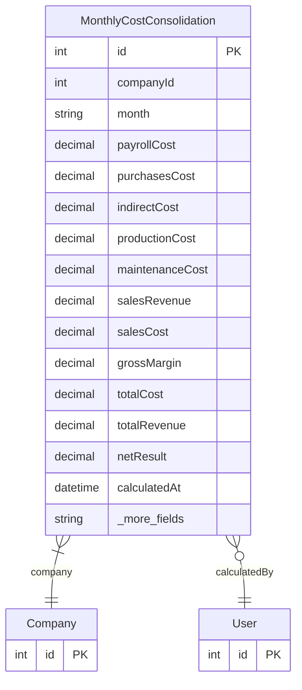

# MonthlyCostConsolidation

> Table name: `monthly_cost_consolidations`

**Schema location:** Lines 12719-12755

## Fields

| Field | Type | Required | Unique | Default | Notes |
|-------|------|----------|--------|---------|-------|
| `id` | `Int` | ✅ | 🔑 PK | `autoincrement(` |  |
| `companyId` | `Int` | ✅ |  | `` |  |
| `month` | `String` | ✅ |  | `` | Formato "2026-01" |
| `payrollCost` | `Decimal` | ✅ |  | `0` | DB: Decimal(14, 2). Nóminas |
| `purchasesCost` | `Decimal` | ✅ |  | `0` | DB: Decimal(14, 2). Compras |
| `indirectCost` | `Decimal` | ✅ |  | `0` | DB: Decimal(14, 2). Indirectos |
| `productionCost` | `Decimal` | ✅ |  | `0` | DB: Decimal(14, 2). Producción (insumos) |
| `maintenanceCost` | `Decimal` | ✅ |  | `0` | DB: Decimal(14, 2). Mantenimiento (read-only) |
| `salesRevenue` | `Decimal` | ✅ |  | `0` | DB: Decimal(14, 2). Ventas (facturado) |
| `salesCost` | `Decimal` | ✅ |  | `0` | DB: Decimal(14, 2). COGS real o fallback |
| `grossMargin` | `Decimal` | ✅ |  | `0` | DB: Decimal(14, 2). salesRevenue - salesCost |
| `totalCost` | `Decimal` | ✅ |  | `0` | DB: Decimal(14, 2). SUM de todos los costos |
| `totalRevenue` | `Decimal` | ✅ |  | `0` | DB: Decimal(14, 2) |
| `netResult` | `Decimal` | ✅ |  | `0` | DB: Decimal(14, 2). totalRevenue - totalCost |
| `calculatedAt` | `DateTime` | ✅ |  | `now(` | Metadata - SNAPSHOT pattern |
| `calculatedById` | `Int?` | ❌ |  | `` | Usuario que recalculó |
| `version` | `String` | ✅ |  | `"V1"` | "V1" | "V2" |
| `details` | `Json?` | ❌ |  | `` | Desglose detallado por fuente |
| `isClosed` | `Boolean` | ✅ |  | `false` | Período cerrado (no recalcular) |

## Relations

| Field | Type | Cardinality | FK Fields | References | On Delete |
|-------|------|-------------|-----------|------------|-----------|
| `company` | [Company](./models/Company.md) | Many-to-One | companyId | id | Cascade |
| `calculatedBy` | [User](./models/User.md) | Many-to-One (optional) | calculatedById | id | - |

## Referenced By

| Model | Field | Cardinality |
|-------|-------|-------------|
| [Company](./models/Company.md) | `monthlyCostConsolidations` | Has many |
| [User](./models/User.md) | `costConsolidationsCalculated` | Has many |

## Indexes

- `companyId, month`

## Unique Constraints

- `companyId, month`

## Entity Diagram

