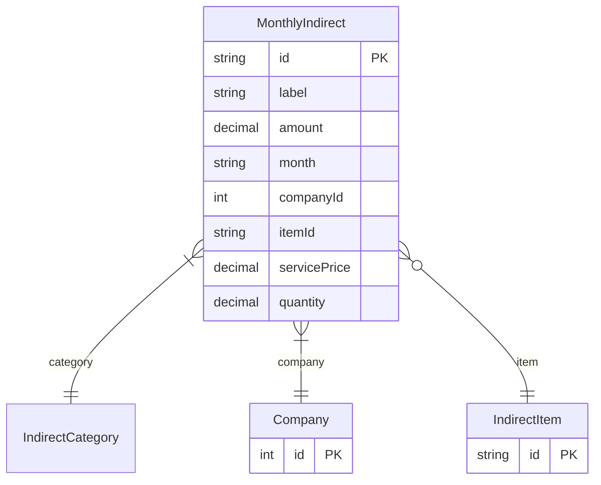

# MonthlyIndirect

> Table name: `MonthlyIndirect`

**Schema location:** Lines 2718-2733

## Fields

| Field | Type | Required | Unique | Default | Notes |
|-------|------|----------|--------|---------|-------|
| `id` | `String` | ✅ | 🔑 PK | `uuid(` |  |
| `label` | `String` | ✅ |  | `` |  |
| `amount` | `Decimal` | ✅ |  | `` | DB: Decimal(12, 2) |
| `month` | `String` | ✅ |  | `` |  |
| `companyId` | `Int` | ✅ |  | `` |  |
| `itemId` | `String?` | ❌ |  | `` |  |
| `servicePrice` | `Decimal?` | ❌ |  | `` | DB: Decimal(12, 4) |
| `quantity` | `Decimal?` | ❌ |  | `` | DB: Decimal(12, 4) |

## Relations

| Field | Type | Cardinality | FK Fields | References | On Delete |
|-------|------|-------------|-----------|------------|-----------|
| `category` | [IndirectCategory](./models/IndirectCategory.md) | Many-to-One | - | - | - |
| `company` | [Company](./models/Company.md) | Many-to-One | companyId | id | Cascade |
| `item` | [IndirectItem](./models/IndirectItem.md) | Many-to-One (optional) | itemId | id | - |

## Referenced By

| Model | Field | Cardinality |
|-------|-------|-------------|
| [Company](./models/Company.md) | `monthlyIndirects` | Has many |
| [IndirectItem](./models/IndirectItem.md) | `monthlyIndirects` | Has many |

## Indexes

- `companyId, month`

## Entity Diagram

