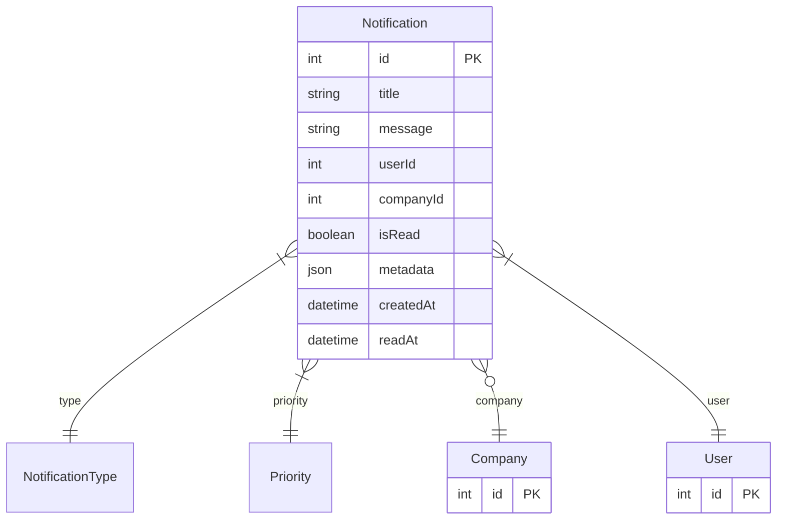

# Notification

> Table name: `Notification`

**Schema location:** Lines 2081-2100

## Fields

| Field | Type | Required | Unique | Default | Notes |
|-------|------|----------|--------|---------|-------|
| `id` | `Int` | ✅ | 🔑 PK | `autoincrement(` |  |
| `title` | `String` | ✅ |  | `` |  |
| `message` | `String` | ✅ |  | `` |  |
| `userId` | `Int` | ✅ |  | `` |  |
| `companyId` | `Int?` | ❌ |  | `` |  |
| `isRead` | `Boolean` | ✅ |  | `false` |  |
| `metadata` | `Json?` | ❌ |  | `` |  |
| `createdAt` | `DateTime` | ✅ |  | `now(` |  |
| `readAt` | `DateTime?` | ❌ |  | `` |  |

## Relations

| Field | Type | Cardinality | FK Fields | References | On Delete |
|-------|------|-------------|-----------|------------|-----------|
| `type` | [NotificationType](./models/NotificationType.md) | Many-to-One | - | - | - |
| `priority` | [Priority](./models/Priority.md) | Many-to-One | - | - | - |
| `company` | [Company](./models/Company.md) | Many-to-One (optional) | companyId | id | Cascade |
| `user` | [User](./models/User.md) | Many-to-One | userId | id | Cascade |

## Referenced By

| Model | Field | Cardinality |
|-------|-------|-------------|
| [Company](./models/Company.md) | `notifications` | Has many |
| [User](./models/User.md) | `notifications` | Has many |

## Indexes

- `userId, companyId, readAt`
- `userId, companyId, createdAt`
- `companyId, readAt`

## Entity Diagram

