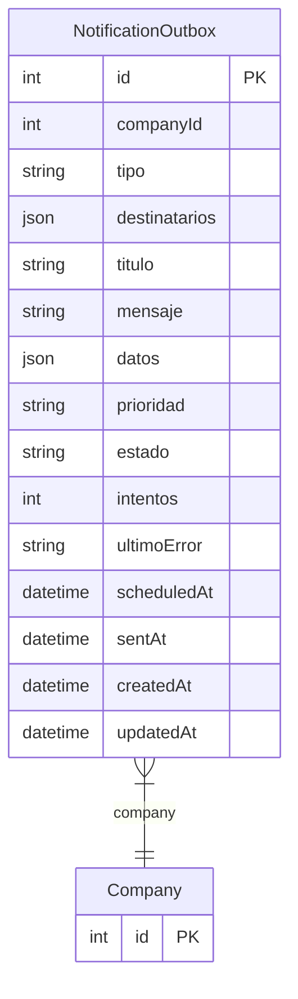

# NotificationOutbox

> Table name: `notification_outbox`

**Schema location:** Lines 7146-7171

## Fields

| Field | Type | Required | Unique | Default | Notes |
|-------|------|----------|--------|---------|-------|
| `id` | `Int` | ✅ | 🔑 PK | `autoincrement(` |  |
| `companyId` | `Int` | ✅ |  | `` |  |
| `tipo` | `String` | ✅ |  | `` | DB: VarChar(50). URGENTE_PEDIDO, SLA_BREACH, MATCH_EXCEPTION, etc |
| `destinatarios` | `Json` | ✅ |  | `` | Array de { userId, email, channel } |
| `titulo` | `String` | ✅ |  | `` | DB: VarChar(255) |
| `mensaje` | `String` | ✅ |  | `` |  |
| `datos` | `Json?` | ❌ |  | `` | Datos adicionales para template |
| `prioridad` | `String` | ✅ |  | `"NORMAL"` | DB: VarChar(20) |
| `estado` | `String` | ✅ |  | `"PENDING"` | DB: VarChar(20). PENDING, SENT, FAILED, CANCELLED |
| `intentos` | `Int` | ✅ |  | `0` |  |
| `ultimoError` | `String?` | ❌ |  | `` |  |
| `scheduledAt` | `DateTime?` | ❌ |  | `` | Para envíos programados |
| `sentAt` | `DateTime?` | ❌ |  | `` |  |
| `createdAt` | `DateTime` | ✅ |  | `now(` |  |
| `updatedAt` | `DateTime` | ✅ |  | `` |  |

## Relations

| Field | Type | Cardinality | FK Fields | References | On Delete |
|-------|------|-------------|-----------|------------|-----------|
| `company` | [Company](./models/Company.md) | Many-to-One | companyId | id | Cascade |

## Referenced By

| Model | Field | Cardinality |
|-------|-------|-------------|
| [Company](./models/Company.md) | `notificationOutbox` | Has many |

## Indexes

- `companyId`
- `estado`
- `scheduledAt`

## Entity Diagram

