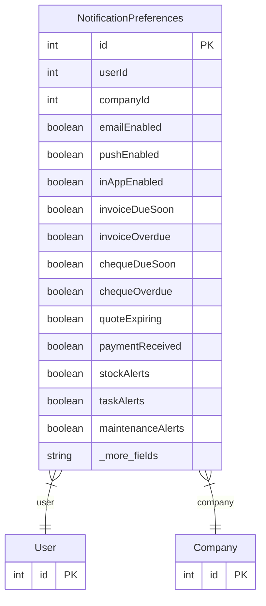

# NotificationPreferences

> Table name: `NotificationPreferences`

**Schema location:** Lines 2102-2134

## Fields

| Field | Type | Required | Unique | Default | Notes |
|-------|------|----------|--------|---------|-------|
| `id` | `Int` | ✅ | 🔑 PK | `autoincrement(` |  |
| `userId` | `Int` | ✅ |  | `` |  |
| `companyId` | `Int` | ✅ |  | `` |  |
| `emailEnabled` | `Boolean` | ✅ |  | `true` | Canales habilitados |
| `pushEnabled` | `Boolean` | ✅ |  | `true` |  |
| `inAppEnabled` | `Boolean` | ✅ |  | `true` |  |
| `invoiceDueSoon` | `Boolean` | ✅ |  | `true` | Tipos de notificación habilitados |
| `invoiceOverdue` | `Boolean` | ✅ |  | `true` |  |
| `chequeDueSoon` | `Boolean` | ✅ |  | `true` |  |
| `chequeOverdue` | `Boolean` | ✅ |  | `true` |  |
| `quoteExpiring` | `Boolean` | ✅ |  | `true` |  |
| `paymentReceived` | `Boolean` | ✅ |  | `true` |  |
| `stockAlerts` | `Boolean` | ✅ |  | `true` |  |
| `taskAlerts` | `Boolean` | ✅ |  | `true` |  |
| `maintenanceAlerts` | `Boolean` | ✅ |  | `true` |  |
| `invoiceDaysBefore` | `Int` | ✅ |  | `3` | Configuración de anticipación (días) |
| `chequeDaysBefore` | `Int` | ✅ |  | `1` |  |
| `quoteDaysBefore` | `Int` | ✅ |  | `7` |  |
| `quietHoursStart` | `String?` | ❌ |  | `` | e.g. "22:00" |
| `quietHoursEnd` | `String?` | ❌ |  | `` | e.g. "08:00" |
| `createdAt` | `DateTime` | ✅ |  | `now(` |  |
| `updatedAt` | `DateTime` | ✅ |  | `` |  |

## Relations

| Field | Type | Cardinality | FK Fields | References | On Delete |
|-------|------|-------------|-----------|------------|-----------|
| `user` | [User](./models/User.md) | Many-to-One | userId | id | Cascade |
| `company` | [Company](./models/Company.md) | Many-to-One | companyId | id | Cascade |

## Referenced By

| Model | Field | Cardinality |
|-------|-------|-------------|
| [Company](./models/Company.md) | `notificationPreferences` | Has many |
| [User](./models/User.md) | `notificationPreferences` | Has many |

## Unique Constraints

- `userId, companyId`

## Entity Diagram

