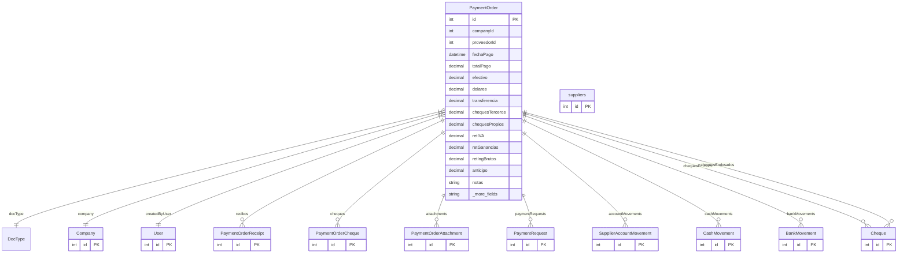

# PaymentOrder

> Table name: `PaymentOrder`

**Schema location:** Lines 4824-4877

## Fields

| Field | Type | Required | Unique | Default | Notes |
|-------|------|----------|--------|---------|-------|
| `id` | `Int` | ✅ | 🔑 PK | `autoincrement(` |  |
| `companyId` | `Int` | ✅ |  | `` |  |
| `proveedorId` | `Int` | ✅ |  | `` |  |
| `fechaPago` | `DateTime` | ✅ |  | `` | DB: Date |
| `totalPago` | `Decimal` | ✅ |  | `` | DB: Decimal(15, 2) |
| `efectivo` | `Decimal` | ✅ |  | `0` | DB: Decimal(15, 2) |
| `dolares` | `Decimal` | ✅ |  | `0` | DB: Decimal(15, 2) |
| `transferencia` | `Decimal` | ✅ |  | `0` | DB: Decimal(15, 2) |
| `chequesTerceros` | `Decimal` | ✅ |  | `0` | DB: Decimal(15, 2) |
| `chequesPropios` | `Decimal` | ✅ |  | `0` | DB: Decimal(15, 2) |
| `retIVA` | `Decimal` | ✅ |  | `0` | DB: Decimal(15, 2) |
| `retGanancias` | `Decimal` | ✅ |  | `0` | DB: Decimal(15, 2) |
| `retIngBrutos` | `Decimal` | ✅ |  | `0` | DB: Decimal(15, 2) |
| `anticipo` | `Decimal` | ✅ |  | `0` | DB: Decimal(15, 2) |
| `notas` | `String?` | ❌ |  | `` |  |
| `estado` | `String?` | ❌ |  | `"EJECUTADO"` | PENDIENTE_APROBACION, EJECUTADO, RECHAZADO |
| `requiereDobleAprobacion` | `Boolean` | ✅ |  | `false` |  |
| `primeraAprobacionBy` | `Int?` | ❌ |  | `` |  |
| `primeraAprobacionAt` | `DateTime?` | ❌ |  | `` |  |
| `segundaAprobacionBy` | `Int?` | ❌ |  | `` |  |
| `segundaAprobacionAt` | `DateTime?` | ❌ |  | `` |  |
| `motivoRechazo` | `String?` | ❌ |  | `` |  |
| `createdBy` | `Int` | ✅ |  | `` |  |
| `createdAt` | `DateTime` | ✅ |  | `now(` |  |
| `updatedAt` | `DateTime` | ✅ |  | `` |  |
| `proveedor` | `suppliers` | ✅ |  | `` |  |

## Relations

| Field | Type | Cardinality | FK Fields | References | On Delete |
|-------|------|-------------|-----------|------------|-----------|
| `docType` | [DocType](./models/DocType.md) | Many-to-One | - | - | - |
| `company` | [Company](./models/Company.md) | Many-to-One | companyId | id | Cascade |
| `createdByUser` | [User](./models/User.md) | Many-to-One | createdBy | id | - |
| `recibos` | [PaymentOrderReceipt](./models/PaymentOrderReceipt.md) | One-to-Many | - | - | - |
| `cheques` | [PaymentOrderCheque](./models/PaymentOrderCheque.md) | One-to-Many | - | - | - |
| `attachments` | [PaymentOrderAttachment](./models/PaymentOrderAttachment.md) | One-to-Many | - | - | - |
| `paymentRequests` | [PaymentRequest](./models/PaymentRequest.md) | One-to-Many | - | - | - |
| `accountMovements` | [SupplierAccountMovement](./models/SupplierAccountMovement.md) | One-to-Many | - | - | - |
| `cashMovements` | [CashMovement](./models/CashMovement.md) | One-to-Many | - | - | - |
| `bankMovements` | [BankMovement](./models/BankMovement.md) | One-to-Many | - | - | - |
| `chequesEmitidos` | [Cheque](./models/Cheque.md) | One-to-Many | - | - | - |
| `chequesEndosados` | [Cheque](./models/Cheque.md) | One-to-Many | - | - | - |

## Referenced By

| Model | Field | Cardinality |
|-------|-------|-------------|
| [Company](./models/Company.md) | `paymentOrders` | Has many |
| [User](./models/User.md) | `createdPaymentOrders` | Has many |
| [suppliers](./models/suppliers.md) | `paymentOrders` | Has many |
| [SupplierAccountMovement](./models/SupplierAccountMovement.md) | `pago` | Has one |
| [PaymentOrderReceipt](./models/PaymentOrderReceipt.md) | `paymentOrder` | Has one |
| [PaymentOrderCheque](./models/PaymentOrderCheque.md) | `paymentOrder` | Has one |
| [PaymentOrderAttachment](./models/PaymentOrderAttachment.md) | `paymentOrder` | Has one |
| [PaymentRequest](./models/PaymentRequest.md) | `paymentOrder` | Has one |
| [CashMovement](./models/CashMovement.md) | `paymentOrder` | Has one |
| [BankMovement](./models/BankMovement.md) | `paymentOrder` | Has one |
| [Cheque](./models/Cheque.md) | `paymentOrder` | Has one |
| [Cheque](./models/Cheque.md) | `endosadoPaymentOrder` | Has one |

## Indexes

- `companyId`
- `proveedorId`
- `fechaPago`
- `docType`
- `companyId, docType`

## Entity Diagram

