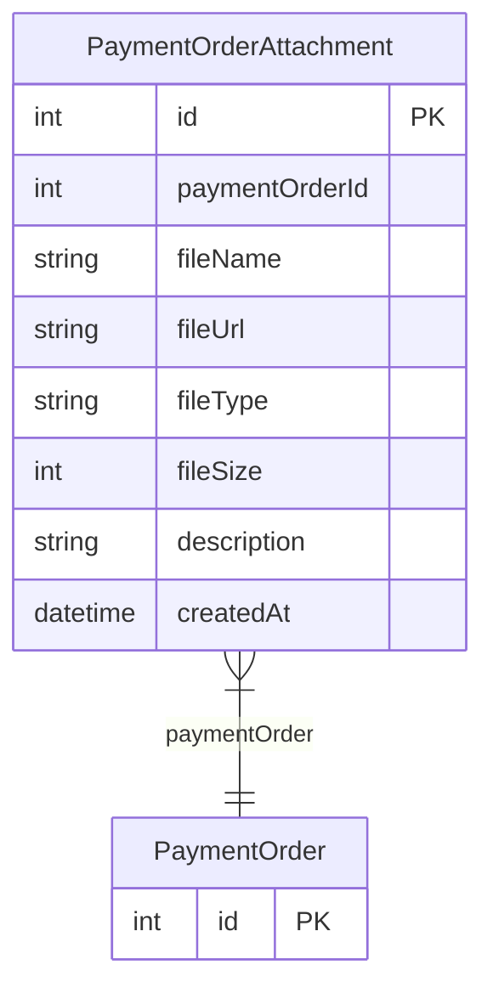

# PaymentOrderAttachment

> Table name: `PaymentOrderAttachment`

**Schema location:** Lines 4912-4925

## Fields

| Field | Type | Required | Unique | Default | Notes |
|-------|------|----------|--------|---------|-------|
| `id` | `Int` | ✅ | 🔑 PK | `autoincrement(` |  |
| `paymentOrderId` | `Int` | ✅ |  | `` |  |
| `fileName` | `String` | ✅ |  | `` | DB: VarChar(255) |
| `fileUrl` | `String` | ✅ |  | `` | DB: VarChar(500) |
| `fileType` | `String` | ✅ |  | `` | DB: VarChar(100). MIME type |
| `fileSize` | `Int?` | ❌ |  | `` | Tamaño en bytes |
| `description` | `String?` | ❌ |  | `` | DB: VarChar(255). "Comprobante transferencia", "Echeq", etc. |
| `createdAt` | `DateTime` | ✅ |  | `now(` |  |

## Relations

| Field | Type | Cardinality | FK Fields | References | On Delete |
|-------|------|-------------|-----------|------------|-----------|
| `paymentOrder` | [PaymentOrder](./models/PaymentOrder.md) | Many-to-One | paymentOrderId | id | Cascade |

## Referenced By

| Model | Field | Cardinality |
|-------|-------|-------------|
| [PaymentOrder](./models/PaymentOrder.md) | `attachments` | Has many |

## Indexes

- `paymentOrderId`

## Entity Diagram

