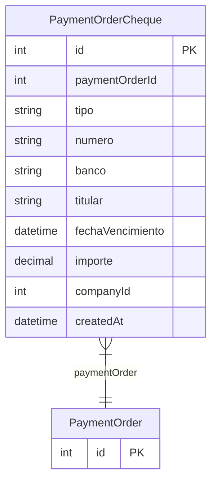

# PaymentOrderCheque

> Table name: `PaymentOrderCheque`

**Schema location:** Lines 4893-4909

## Fields

| Field | Type | Required | Unique | Default | Notes |
|-------|------|----------|--------|---------|-------|
| `id` | `Int` | ✅ | 🔑 PK | `autoincrement(` |  |
| `paymentOrderId` | `Int` | ✅ |  | `` |  |
| `tipo` | `String` | ✅ |  | `` | DB: VarChar(20). CHEQUE / ECHEQ |
| `numero` | `String` | ✅ |  | `` | DB: VarChar(50) |
| `banco` | `String?` | ❌ |  | `` | DB: VarChar(100) |
| `titular` | `String?` | ❌ |  | `` | DB: VarChar(255) |
| `fechaVencimiento` | `DateTime?` | ❌ |  | `` | DB: Date |
| `importe` | `Decimal` | ✅ |  | `` | DB: Decimal(15, 2) |
| `companyId` | `Int` | ✅ |  | `` |  |
| `createdAt` | `DateTime` | ✅ |  | `now(` |  |

## Relations

| Field | Type | Cardinality | FK Fields | References | On Delete |
|-------|------|-------------|-----------|------------|-----------|
| `paymentOrder` | [PaymentOrder](./models/PaymentOrder.md) | Many-to-One | paymentOrderId | id | Cascade |

## Referenced By

| Model | Field | Cardinality |
|-------|-------|-------------|
| [PaymentOrder](./models/PaymentOrder.md) | `cheques` | Has many |

## Indexes

- `paymentOrderId`
- `companyId`

## Entity Diagram

