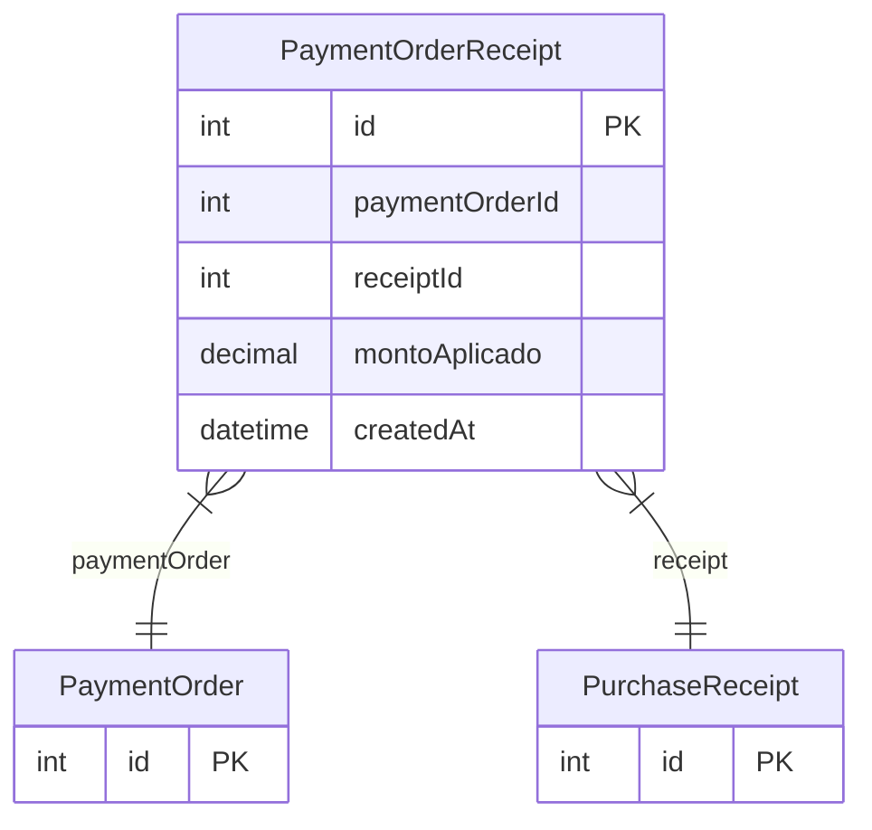

# PaymentOrderReceipt

> Table name: `PaymentOrderReceipt`

**Schema location:** Lines 4879-4891

## Fields

| Field | Type | Required | Unique | Default | Notes |
|-------|------|----------|--------|---------|-------|
| `id` | `Int` | ✅ | 🔑 PK | `autoincrement(` |  |
| `paymentOrderId` | `Int` | ✅ |  | `` |  |
| `receiptId` | `Int` | ✅ |  | `` |  |
| `montoAplicado` | `Decimal` | ✅ |  | `` | DB: Decimal(15, 2) |
| `createdAt` | `DateTime` | ✅ |  | `now(` |  |

## Relations

| Field | Type | Cardinality | FK Fields | References | On Delete |
|-------|------|-------------|-----------|------------|-----------|
| `paymentOrder` | [PaymentOrder](./models/PaymentOrder.md) | Many-to-One | paymentOrderId | id | Cascade |
| `receipt` | [PurchaseReceipt](./models/PurchaseReceipt.md) | Many-to-One | receiptId | id | Cascade |

## Referenced By

| Model | Field | Cardinality |
|-------|-------|-------------|
| [PurchaseReceipt](./models/PurchaseReceipt.md) | `PaymentOrderReceipt` | Has many |
| [PaymentOrder](./models/PaymentOrder.md) | `recibos` | Has many |

## Indexes

- `paymentOrderId`
- `receiptId`

## Entity Diagram

