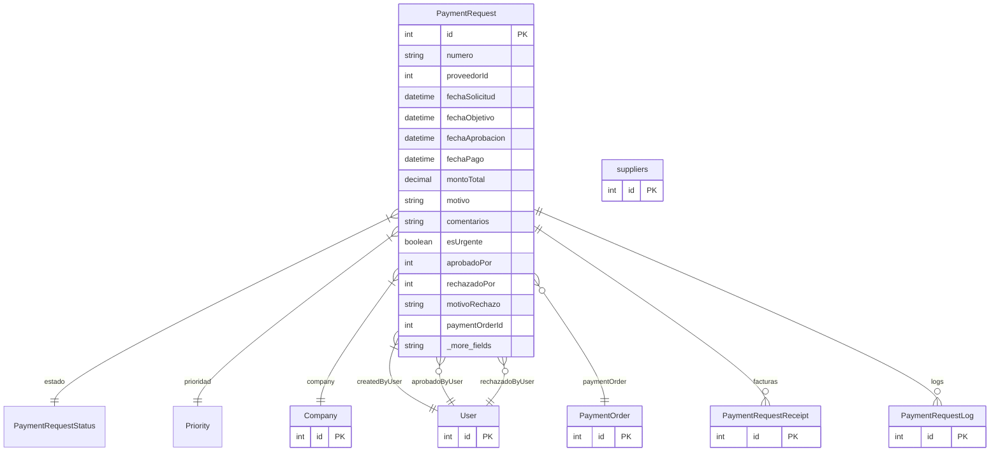

# PaymentRequest

> Table name: `payment_requests`

**Schema location:** Lines 7360-7405

## Fields

| Field | Type | Required | Unique | Default | Notes |
|-------|------|----------|--------|---------|-------|
| `id` | `Int` | ✅ | 🔑 PK | `autoincrement(` |  |
| `numero` | `String` | ✅ |  | `` | DB: VarChar(50) |
| `proveedorId` | `Int` | ✅ |  | `` |  |
| `fechaSolicitud` | `DateTime` | ✅ |  | `` | DB: Date. Fechas |
| `fechaObjetivo` | `DateTime?` | ❌ |  | `` | DB: Date. "Para cuándo" necesita el pago |
| `fechaAprobacion` | `DateTime?` | ❌ |  | `` |  |
| `fechaPago` | `DateTime?` | ❌ |  | `` |  |
| `montoTotal` | `Decimal` | ✅ |  | `` | DB: Decimal(15, 2). Montos |
| `motivo` | `String?` | ❌ |  | `` | Justificación |
| `comentarios` | `String?` | ❌ |  | `` |  |
| `esUrgente` | `Boolean` | ✅ |  | `false` |  |
| `aprobadoPor` | `Int?` | ❌ |  | `` | Aprobación |
| `rechazadoPor` | `Int?` | ❌ |  | `` |  |
| `motivoRechazo` | `String?` | ❌ |  | `` |  |
| `paymentOrderId` | `Int?` | ❌ |  | `` | Conversión a orden de pago |
| `companyId` | `Int` | ✅ |  | `` | Tracking |
| `createdBy` | `Int` | ✅ |  | `` |  |
| `createdAt` | `DateTime` | ✅ |  | `now(` |  |
| `updatedAt` | `DateTime` | ✅ |  | `` |  |
| `proveedor` | `suppliers` | ✅ |  | `` |  |

## Relations

| Field | Type | Cardinality | FK Fields | References | On Delete |
|-------|------|-------------|-----------|------------|-----------|
| `estado` | [PaymentRequestStatus](./models/PaymentRequestStatus.md) | Many-to-One | - | - | - |
| `prioridad` | [Priority](./models/Priority.md) | Many-to-One | - | - | - |
| `company` | [Company](./models/Company.md) | Many-to-One | companyId | id | Cascade |
| `createdByUser` | [User](./models/User.md) | Many-to-One | createdBy | id | - |
| `aprobadoByUser` | [User](./models/User.md) | Many-to-One (optional) | aprobadoPor | id | - |
| `rechazadoByUser` | [User](./models/User.md) | Many-to-One (optional) | rechazadoPor | id | - |
| `paymentOrder` | [PaymentOrder](./models/PaymentOrder.md) | Many-to-One (optional) | paymentOrderId | id | - |
| `facturas` | [PaymentRequestReceipt](./models/PaymentRequestReceipt.md) | One-to-Many | - | - | - |
| `logs` | [PaymentRequestLog](./models/PaymentRequestLog.md) | One-to-Many | - | - | - |

## Referenced By

| Model | Field | Cardinality |
|-------|-------|-------------|
| [Company](./models/Company.md) | `paymentRequests` | Has many |
| [User](./models/User.md) | `paymentRequestsCreated` | Has many |
| [User](./models/User.md) | `paymentRequestsApproved` | Has many |
| [User](./models/User.md) | `paymentRequestsRejected` | Has many |
| [suppliers](./models/suppliers.md) | `paymentRequests` | Has many |
| [PaymentOrder](./models/PaymentOrder.md) | `paymentRequests` | Has many |
| [PaymentRequestReceipt](./models/PaymentRequestReceipt.md) | `paymentRequest` | Has one |
| [PaymentRequestLog](./models/PaymentRequestLog.md) | `paymentRequest` | Has one |

## Indexes

- `companyId`
- `proveedorId`
- `estado`
- `prioridad`
- `esUrgente`

## Unique Constraints

- `companyId, numero`

## Entity Diagram

