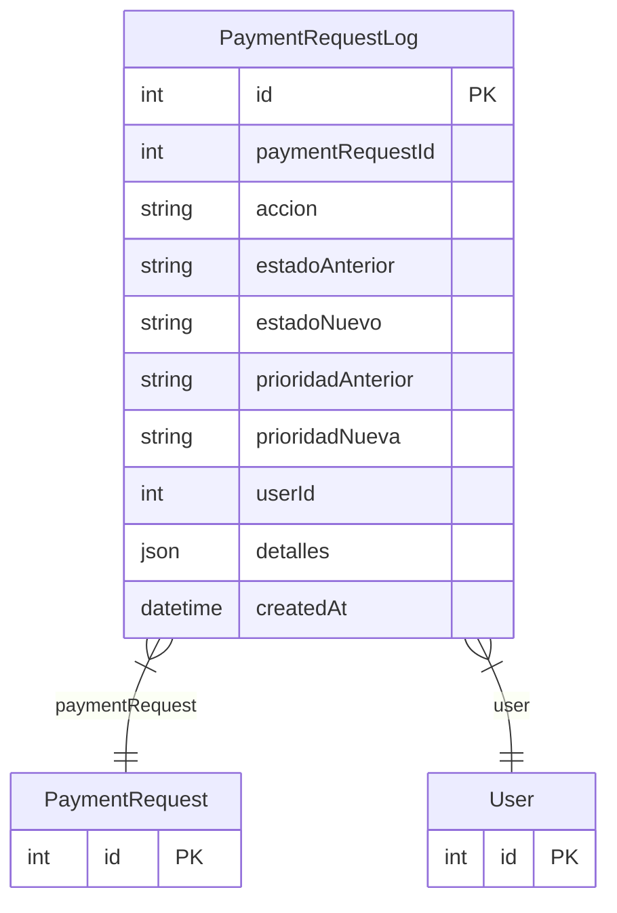

# PaymentRequestLog

> Table name: `payment_request_logs`

**Schema location:** Lines 7434-7453

## Fields

| Field | Type | Required | Unique | Default | Notes |
|-------|------|----------|--------|---------|-------|
| `id` | `Int` | ✅ | 🔑 PK | `autoincrement(` |  |
| `paymentRequestId` | `Int` | ✅ |  | `` |  |
| `accion` | `String` | ✅ |  | `` | DB: VarChar(50). CREADA, EDITADA, ELIMINADA, ESTADO_CAMBIADO, PRIORIDAD_ELEVADA |
| `estadoAnterior` | `String?` | ❌ |  | `` | DB: VarChar(30) |
| `estadoNuevo` | `String?` | ❌ |  | `` | DB: VarChar(30) |
| `prioridadAnterior` | `String?` | ❌ |  | `` | DB: VarChar(20) |
| `prioridadNueva` | `String?` | ❌ |  | `` | DB: VarChar(20) |
| `userId` | `Int` | ✅ |  | `` |  |
| `detalles` | `Json?` | ❌ |  | `` | Campos que cambiaron |
| `createdAt` | `DateTime` | ✅ |  | `now(` |  |

## Relations

| Field | Type | Cardinality | FK Fields | References | On Delete |
|-------|------|-------------|-----------|------------|-----------|
| `paymentRequest` | [PaymentRequest](./models/PaymentRequest.md) | Many-to-One | paymentRequestId | id | Cascade |
| `user` | [User](./models/User.md) | Many-to-One | userId | id | - |

## Referenced By

| Model | Field | Cardinality |
|-------|-------|-------------|
| [User](./models/User.md) | `paymentRequestLogs` | Has many |
| [PaymentRequest](./models/PaymentRequest.md) | `logs` | Has many |

## Indexes

- `paymentRequestId`
- `userId`
- `createdAt`

## Entity Diagram

