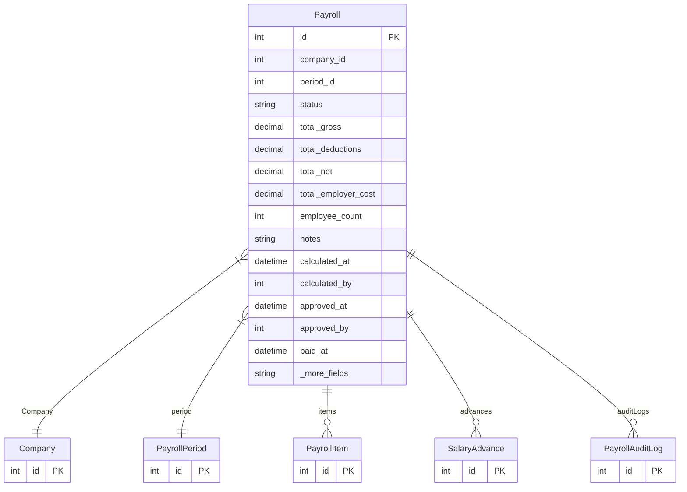

# Payroll

> Table name: `payrolls`

**Schema location:** Lines 11789-11821

## Fields

| Field | Type | Required | Unique | Default | Notes |
|-------|------|----------|--------|---------|-------|
| `id` | `Int` | ✅ | 🔑 PK | `autoincrement(` |  |
| `company_id` | `Int` | ✅ |  | `` |  |
| `period_id` | `Int` | ✅ |  | `` |  |
| `status` | `String` | ✅ |  | `"DRAFT"` | DB: VarChar(20). DRAFT, CALCULATED, APPROVED, PAID, CANCELLED |
| `total_gross` | `Decimal` | ✅ |  | `` | DB: Decimal(14, 2) |
| `total_deductions` | `Decimal` | ✅ |  | `` | DB: Decimal(14, 2) |
| `total_net` | `Decimal` | ✅ |  | `` | DB: Decimal(14, 2) |
| `total_employer_cost` | `Decimal` | ✅ |  | `` | DB: Decimal(14, 2) |
| `employee_count` | `Int` | ✅ |  | `` |  |
| `notes` | `String?` | ❌ |  | `` |  |
| `calculated_at` | `DateTime?` | ❌ |  | `` |  |
| `calculated_by` | `Int?` | ❌ |  | `` |  |
| `approved_at` | `DateTime?` | ❌ |  | `` |  |
| `approved_by` | `Int?` | ❌ |  | `` |  |
| `paid_at` | `DateTime?` | ❌ |  | `` |  |
| `paid_by` | `Int?` | ❌ |  | `` |  |
| `cancelled_at` | `DateTime?` | ❌ |  | `` |  |
| `cancelled_by` | `Int?` | ❌ |  | `` |  |
| `cancel_reason` | `String?` | ❌ |  | `` |  |
| `created_at` | `DateTime` | ✅ |  | `now(` |  |
| `updated_at` | `DateTime` | ✅ |  | `` |  |

## Relations

| Field | Type | Cardinality | FK Fields | References | On Delete |
|-------|------|-------------|-----------|------------|-----------|
| `Company` | [Company](./models/Company.md) | Many-to-One | company_id | id | Cascade |
| `period` | [PayrollPeriod](./models/PayrollPeriod.md) | Many-to-One | period_id | id | Cascade |
| `items` | [PayrollItem](./models/PayrollItem.md) | One-to-Many | - | - | - |
| `advances` | [SalaryAdvance](./models/SalaryAdvance.md) | One-to-Many | - | - | - |
| `auditLogs` | [PayrollAuditLog](./models/PayrollAuditLog.md) | One-to-Many | - | - | - |

## Referenced By

| Model | Field | Cardinality |
|-------|-------|-------------|
| [Company](./models/Company.md) | `payrolls` | Has many |
| [PayrollPeriod](./models/PayrollPeriod.md) | `payrolls` | Has many |
| [PayrollItem](./models/PayrollItem.md) | `payroll` | Has one |
| [SalaryAdvance](./models/SalaryAdvance.md) | `payroll` | Has one |
| [PayrollAuditLog](./models/PayrollAuditLog.md) | `payroll` | Has one |

## Indexes

- `company_id, status`
- `period_id`

## Entity Diagram

