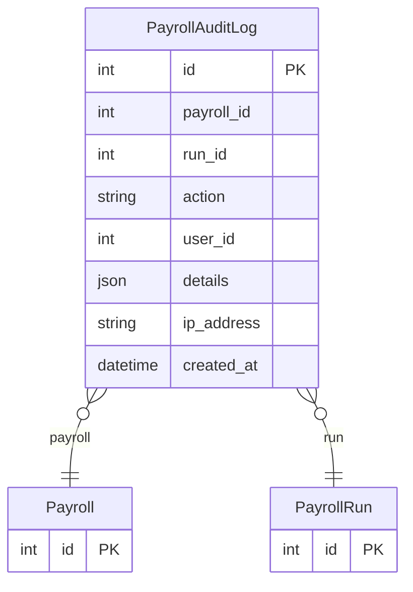

# PayrollAuditLog

> Table name: `payroll_audit_logs`

**Schema location:** Lines 11924-11941

## Fields

| Field | Type | Required | Unique | Default | Notes |
|-------|------|----------|--------|---------|-------|
| `id` | `Int` | ✅ | 🔑 PK | `autoincrement(` |  |
| `payroll_id` | `Int?` | ❌ |  | `` |  |
| `run_id` | `Int?` | ❌ |  | `` | v4: auditoría de corridas |
| `action` | `String` | ✅ |  | `` | DB: VarChar(50). CREATED, CALCULATED, RECALCULATED, APPROVED, PAID, CANCELLED, REOPENED, LOCKED |
| `user_id` | `Int` | ✅ |  | `` |  |
| `details` | `Json?` | ❌ |  | `` |  |
| `ip_address` | `String?` | ❌ |  | `` | DB: VarChar(50) |
| `created_at` | `DateTime` | ✅ |  | `now(` |  |

## Relations

| Field | Type | Cardinality | FK Fields | References | On Delete |
|-------|------|-------------|-----------|------------|-----------|
| `payroll` | [Payroll](./models/Payroll.md) | Many-to-One (optional) | payroll_id | id | Cascade |
| `run` | [PayrollRun](./models/PayrollRun.md) | Many-to-One (optional) | run_id | id | Cascade |

## Referenced By

| Model | Field | Cardinality |
|-------|-------|-------------|
| [Payroll](./models/Payroll.md) | `auditLogs` | Has many |
| [PayrollRun](./models/PayrollRun.md) | `auditLogs` | Has many |

## Indexes

- `payroll_id`
- `run_id`
- `user_id`

## Entity Diagram

