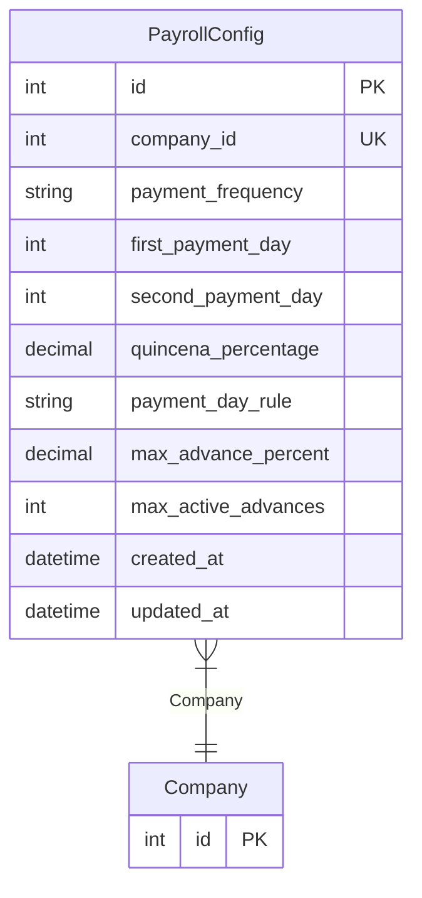

# PayrollConfig

> Table name: `payroll_configs`

**Schema location:** Lines 11627-11643

## Fields

| Field | Type | Required | Unique | Default | Notes |
|-------|------|----------|--------|---------|-------|
| `id` | `Int` | ✅ | 🔑 PK | `autoincrement(` |  |
| `company_id` | `Int` | ✅ | ✅ | `` |  |
| `payment_frequency` | `String` | ✅ |  | `"BIWEEKLY"` | MONTHLY, BIWEEKLY |
| `first_payment_day` | `Int` | ✅ |  | `15` |  |
| `second_payment_day` | `Int` | ✅ |  | `30` |  |
| `quincena_percentage` | `Decimal` | ✅ |  | `50` | DB: Decimal(5, 2) |
| `payment_day_rule` | `String` | ✅ |  | `"PREVIOUS_BUSINESS_DAY"` | PREVIOUS_BUSINESS_DAY, NEXT_BUSINESS_DAY, EXACT |
| `max_advance_percent` | `Decimal` | ✅ |  | `30` | DB: Decimal(5, 2) |
| `max_active_advances` | `Int` | ✅ |  | `1` |  |
| `created_at` | `DateTime` | ✅ |  | `now(` |  |
| `updated_at` | `DateTime` | ✅ |  | `` |  |

## Relations

| Field | Type | Cardinality | FK Fields | References | On Delete |
|-------|------|-------------|-----------|------------|-----------|
| `Company` | [Company](./models/Company.md) | Many-to-One | company_id | id | Cascade |

## Referenced By

| Model | Field | Cardinality |
|-------|-------|-------------|
| [Company](./models/Company.md) | `payrollConfig` | Has one |

## Entity Diagram

