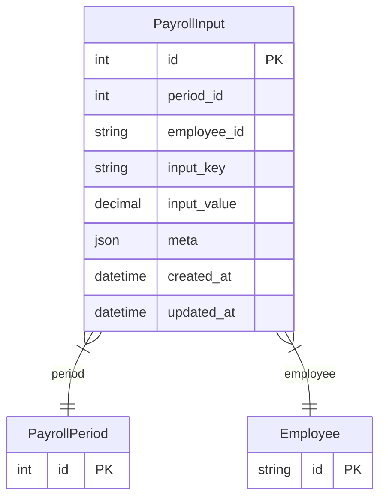

# PayrollInput

> Table name: `payroll_inputs`

**Schema location:** Lines 11769-11786

## Fields

| Field | Type | Required | Unique | Default | Notes |
|-------|------|----------|--------|---------|-------|
| `id` | `Int` | ✅ | 🔑 PK | `autoincrement(` |  |
| `period_id` | `Int` | ✅ |  | `` |  |
| `employee_id` | `String` | ✅ |  | `` | DB: VarChar(255) |
| `input_key` | `String` | ✅ |  | `` | DB: VarChar(50) |
| `input_value` | `Decimal` | ✅ |  | `` | DB: Decimal(12, 4) |
| `meta` | `Json?` | ❌ |  | `` |  |
| `created_at` | `DateTime` | ✅ |  | `now(` |  |
| `updated_at` | `DateTime` | ✅ |  | `` |  |

## Relations

| Field | Type | Cardinality | FK Fields | References | On Delete |
|-------|------|-------------|-----------|------------|-----------|
| `period` | [PayrollPeriod](./models/PayrollPeriod.md) | Many-to-One | period_id | id | Cascade |
| `employee` | [Employee](./models/Employee.md) | Many-to-One | employee_id | id | Cascade |

## Referenced By

| Model | Field | Cardinality |
|-------|-------|-------------|
| [Employee](./models/Employee.md) | `payrollInputs` | Has many |
| [PayrollPeriod](./models/PayrollPeriod.md) | `inputs` | Has many |

## Indexes

- `period_id`
- `employee_id`

## Unique Constraints

- `period_id, employee_id, input_key`

## Entity Diagram

