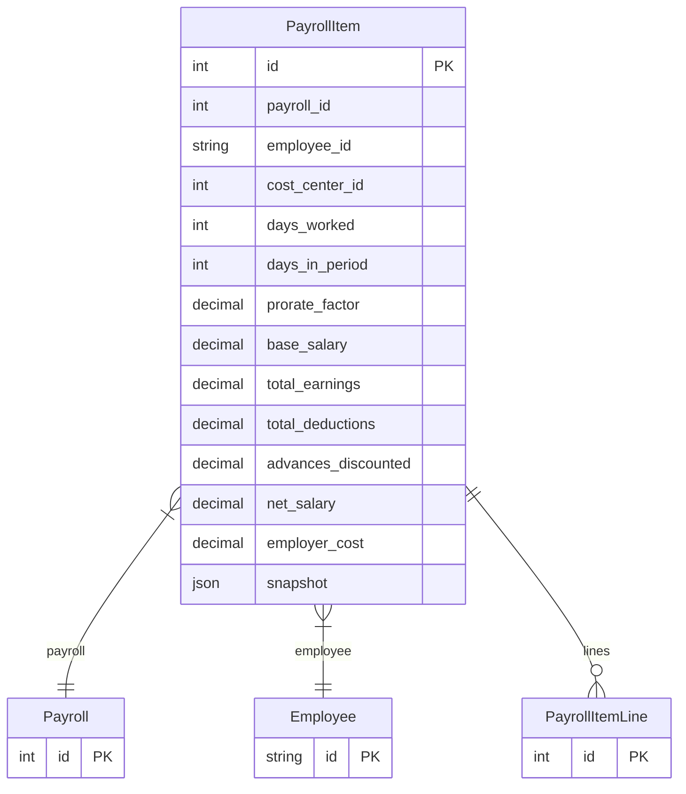

# PayrollItem

> Table name: `payroll_items`

**Schema location:** Lines 11824-11848

## Fields

| Field | Type | Required | Unique | Default | Notes |
|-------|------|----------|--------|---------|-------|
| `id` | `Int` | ✅ | 🔑 PK | `autoincrement(` |  |
| `payroll_id` | `Int` | ✅ |  | `` |  |
| `employee_id` | `String` | ✅ |  | `` | DB: VarChar(255) |
| `cost_center_id` | `Int?` | ❌ |  | `` |  |
| `days_worked` | `Int` | ✅ |  | `30` |  |
| `days_in_period` | `Int` | ✅ |  | `30` |  |
| `prorate_factor` | `Decimal` | ✅ |  | `1` | DB: Decimal(5, 4) |
| `base_salary` | `Decimal` | ✅ |  | `` | DB: Decimal(12, 2) |
| `total_earnings` | `Decimal` | ✅ |  | `` | DB: Decimal(12, 2) |
| `total_deductions` | `Decimal` | ✅ |  | `` | DB: Decimal(12, 2) |
| `advances_discounted` | `Decimal` | ✅ |  | `0` | DB: Decimal(12, 2) |
| `net_salary` | `Decimal` | ✅ |  | `` | DB: Decimal(12, 2) |
| `employer_cost` | `Decimal` | ✅ |  | `` | DB: Decimal(12, 2) |
| `snapshot` | `Json` | ✅ |  | `` |  |

## Relations

| Field | Type | Cardinality | FK Fields | References | On Delete |
|-------|------|-------------|-----------|------------|-----------|
| `payroll` | [Payroll](./models/Payroll.md) | Many-to-One | payroll_id | id | Cascade |
| `employee` | [Employee](./models/Employee.md) | Many-to-One | employee_id | id | Cascade |
| `lines` | [PayrollItemLine](./models/PayrollItemLine.md) | One-to-Many | - | - | - |

## Referenced By

| Model | Field | Cardinality |
|-------|-------|-------------|
| [Employee](./models/Employee.md) | `payrollItems` | Has many |
| [Payroll](./models/Payroll.md) | `items` | Has many |
| [PayrollItemLine](./models/PayrollItemLine.md) | `payrollItem` | Has one |

## Indexes

- `payroll_id`
- `employee_id`

## Unique Constraints

- `payroll_id, employee_id`

## Entity Diagram

