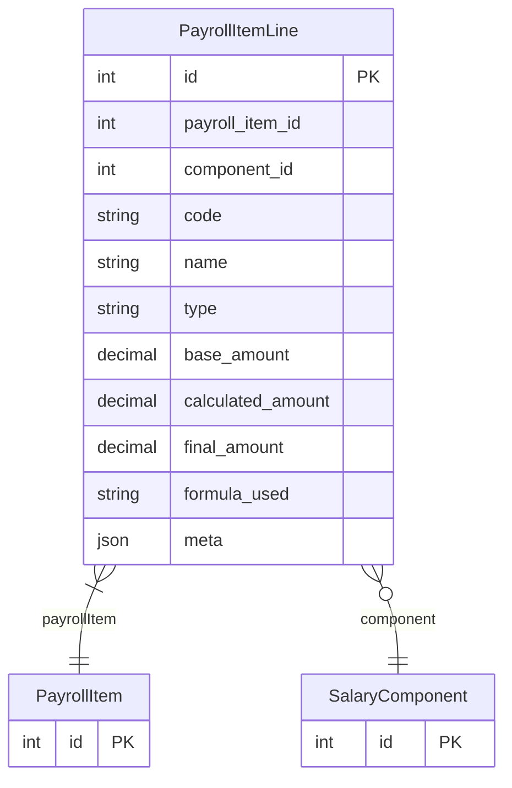

# PayrollItemLine

> Table name: `payroll_item_lines`

**Schema location:** Lines 11851-11871

## Fields

| Field | Type | Required | Unique | Default | Notes |
|-------|------|----------|--------|---------|-------|
| `id` | `Int` | ✅ | 🔑 PK | `autoincrement(` |  |
| `payroll_item_id` | `Int` | ✅ |  | `` |  |
| `component_id` | `Int?` | ❌ |  | `` |  |
| `code` | `String` | ✅ |  | `` | DB: VarChar(50) |
| `name` | `String` | ✅ |  | `` | DB: VarChar(255) |
| `type` | `String` | ✅ |  | `` | DB: VarChar(20). EARNING | DEDUCTION |
| `base_amount` | `Decimal` | ✅ |  | `` | DB: Decimal(12, 2) |
| `calculated_amount` | `Decimal` | ✅ |  | `` | DB: Decimal(12, 2) |
| `final_amount` | `Decimal` | ✅ |  | `` | DB: Decimal(12, 2) |
| `formula_used` | `String?` | ❌ |  | `` |  |
| `meta` | `Json?` | ❌ |  | `` |  |

## Relations

| Field | Type | Cardinality | FK Fields | References | On Delete |
|-------|------|-------------|-----------|------------|-----------|
| `payrollItem` | [PayrollItem](./models/PayrollItem.md) | Many-to-One | payroll_item_id | id | Cascade |
| `component` | [SalaryComponent](./models/SalaryComponent.md) | Many-to-One (optional) | component_id | id | SetNull |

## Referenced By

| Model | Field | Cardinality |
|-------|-------|-------------|
| [SalaryComponent](./models/SalaryComponent.md) | `payrollLines` | Has many |
| [PayrollItem](./models/PayrollItem.md) | `lines` | Has many |

## Indexes

- `payroll_item_id`
- `code`
- `component_id`

## Entity Diagram

