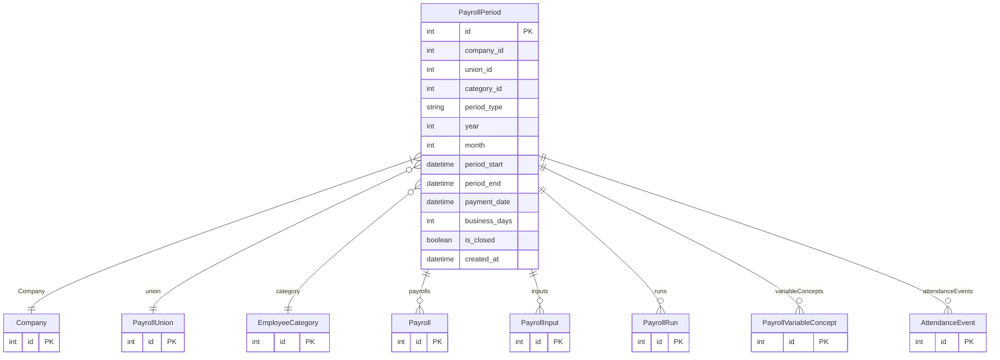

# PayrollPeriod

> Table name: `payroll_periods`

**Schema location:** Lines 11735-11766

## Fields

| Field | Type | Required | Unique | Default | Notes |
|-------|------|----------|--------|---------|-------|
| `id` | `Int` | ✅ | 🔑 PK | `autoincrement(` |  |
| `company_id` | `Int` | ✅ |  | `` |  |
| `union_id` | `Int?` | ❌ |  | `` | v4.1: Período por Gremio (UOCRA = quincenal, Comercio = mensual) |
| `category_id` | `Int?` | ❌ |  | `` | Legacy: Período por categoría (deprecated) |
| `period_type` | `String` | ✅ |  | `` | DB: VarChar(20). QUINCENA_1, QUINCENA_2, MONTHLY |
| `year` | `Int` | ✅ |  | `` |  |
| `month` | `Int` | ✅ |  | `` |  |
| `period_start` | `DateTime` | ✅ |  | `` | DB: Date |
| `period_end` | `DateTime` | ✅ |  | `` | DB: Date |
| `payment_date` | `DateTime` | ✅ |  | `` | DB: Date |
| `business_days` | `Int` | ✅ |  | `` |  |
| `is_closed` | `Boolean` | ✅ |  | `false` |  |
| `created_at` | `DateTime` | ✅ |  | `now(` |  |

## Relations

| Field | Type | Cardinality | FK Fields | References | On Delete |
|-------|------|-------------|-----------|------------|-----------|
| `Company` | [Company](./models/Company.md) | Many-to-One | company_id | id | Cascade |
| `union` | [PayrollUnion](./models/PayrollUnion.md) | Many-to-One (optional) | union_id | id | SetNull |
| `category` | [EmployeeCategory](./models/EmployeeCategory.md) | Many-to-One (optional) | category_id | id | SetNull |
| `payrolls` | [Payroll](./models/Payroll.md) | One-to-Many | - | - | - |
| `inputs` | [PayrollInput](./models/PayrollInput.md) | One-to-Many | - | - | - |
| `runs` | [PayrollRun](./models/PayrollRun.md) | One-to-Many | - | - | - |
| `variableConcepts` | [PayrollVariableConcept](./models/PayrollVariableConcept.md) | One-to-Many | - | - | - |
| `attendanceEvents` | [AttendanceEvent](./models/AttendanceEvent.md) | One-to-Many | - | - | - |

## Referenced By

| Model | Field | Cardinality |
|-------|-------|-------------|
| [Company](./models/Company.md) | `payrollPeriods` | Has many |
| [EmployeeCategory](./models/EmployeeCategory.md) | `periods` | Has many |
| [PayrollInput](./models/PayrollInput.md) | `period` | Has one |
| [Payroll](./models/Payroll.md) | `period` | Has one |
| [PayrollUnion](./models/PayrollUnion.md) | `periods` | Has many |
| [PayrollVariableConcept](./models/PayrollVariableConcept.md) | `period` | Has one |
| [AttendanceEvent](./models/AttendanceEvent.md) | `period` | Has one |
| [PayrollRun](./models/PayrollRun.md) | `period` | Has one |

## Indexes

- `company_id, year, month`
- `union_id`
- `category_id`

## Unique Constraints

- `company_id, year, month, period_type, union_id`

## Entity Diagram

