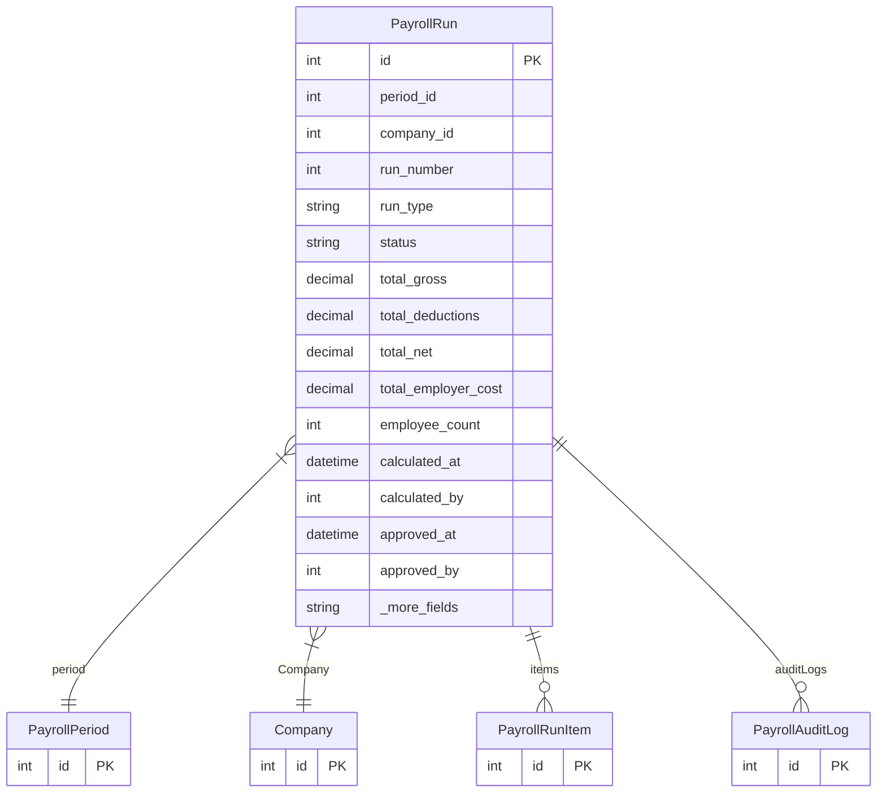

# PayrollRun

> Table name: `payroll_runs`

**Schema location:** Lines 12247-12292

## Fields

| Field | Type | Required | Unique | Default | Notes |
|-------|------|----------|--------|---------|-------|
| `id` | `Int` | ✅ | 🔑 PK | `autoincrement(` |  |
| `period_id` | `Int` | ✅ |  | `` |  |
| `company_id` | `Int` | ✅ |  | `` |  |
| `run_number` | `Int` | ✅ |  | `1` | 1, 2, 3... para recálculos |
| `run_type` | `String` | ✅ |  | `"REGULAR"` | DB: VarChar(20) |
| `status` | `String` | ✅ |  | `"DRAFT"` | DB: VarChar(20). Estado |
| `total_gross` | `Decimal` | ✅ |  | `` | DB: Decimal(14, 2). Totales |
| `total_deductions` | `Decimal` | ✅ |  | `` | DB: Decimal(14, 2) |
| `total_net` | `Decimal` | ✅ |  | `` | DB: Decimal(14, 2) |
| `total_employer_cost` | `Decimal` | ✅ |  | `` | DB: Decimal(14, 2) |
| `employee_count` | `Int` | ✅ |  | `` |  |
| `calculated_at` | `DateTime?` | ❌ |  | `` | Auditoría |
| `calculated_by` | `Int?` | ❌ |  | `` |  |
| `approved_at` | `DateTime?` | ❌ |  | `` |  |
| `approved_by` | `Int?` | ❌ |  | `` |  |
| `paid_at` | `DateTime?` | ❌ |  | `` |  |
| `paid_by` | `Int?` | ❌ |  | `` |  |
| `locked_at` | `DateTime?` | ❌ |  | `` | CRÍTICO: cuando se cierra, no se toca |
| `locked_by` | `Int?` | ❌ |  | `` |  |
| `voided_at` | `DateTime?` | ❌ |  | `` |  |
| `voided_by` | `Int?` | ❌ |  | `` |  |
| `void_reason` | `String?` | ❌ |  | `` |  |
| `notes` | `String?` | ❌ |  | `` |  |
| `created_at` | `DateTime` | ✅ |  | `now(` |  |
| `updated_at` | `DateTime` | ✅ |  | `` |  |

## Relations

| Field | Type | Cardinality | FK Fields | References | On Delete |
|-------|------|-------------|-----------|------------|-----------|
| `period` | [PayrollPeriod](./models/PayrollPeriod.md) | Many-to-One | period_id | id | Cascade |
| `Company` | [Company](./models/Company.md) | Many-to-One | company_id | id | Cascade |
| `items` | [PayrollRunItem](./models/PayrollRunItem.md) | One-to-Many | - | - | - |
| `auditLogs` | [PayrollAuditLog](./models/PayrollAuditLog.md) | One-to-Many | - | - | - |

## Referenced By

| Model | Field | Cardinality |
|-------|-------|-------------|
| [Company](./models/Company.md) | `payrollRuns` | Has many |
| [PayrollPeriod](./models/PayrollPeriod.md) | `runs` | Has many |
| [PayrollAuditLog](./models/PayrollAuditLog.md) | `run` | Has one |
| [PayrollRunItem](./models/PayrollRunItem.md) | `run` | Has one |

## Indexes

- `status`
- `company_id`

## Unique Constraints

- `period_id, run_number`

## Entity Diagram

