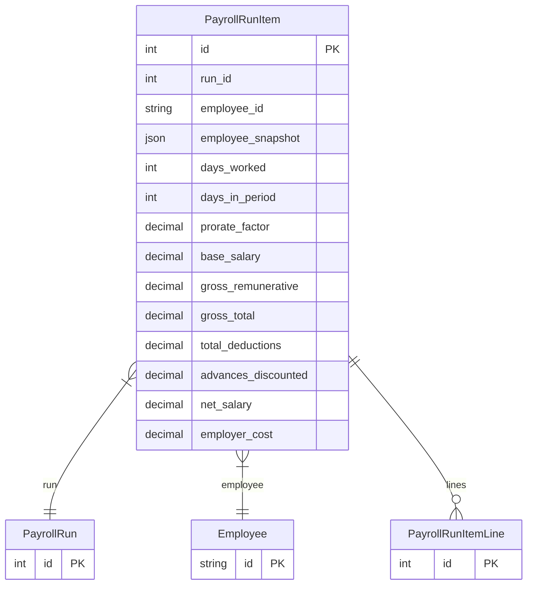

# PayrollRunItem

> Table name: `payroll_run_items`

**Schema location:** Lines 12295-12323

## Fields

| Field | Type | Required | Unique | Default | Notes |
|-------|------|----------|--------|---------|-------|
| `id` | `Int` | ✅ | 🔑 PK | `autoincrement(` |  |
| `run_id` | `Int` | ✅ |  | `` |  |
| `employee_id` | `String` | ✅ |  | `` | DB: VarChar(255) |
| `employee_snapshot` | `Json` | ✅ |  | `` | { category_id, category_name, hire_date, ... } |
| `days_worked` | `Int` | ✅ |  | `30` | Cálculos |
| `days_in_period` | `Int` | ✅ |  | `30` |  |
| `prorate_factor` | `Decimal` | ✅ |  | `1` | DB: Decimal(5, 4) |
| `base_salary` | `Decimal` | ✅ |  | `` | DB: Decimal(12, 2) |
| `gross_remunerative` | `Decimal` | ✅ |  | `` | DB: Decimal(12, 2) |
| `gross_total` | `Decimal` | ✅ |  | `` | DB: Decimal(12, 2) |
| `total_deductions` | `Decimal` | ✅ |  | `` | DB: Decimal(12, 2) |
| `advances_discounted` | `Decimal` | ✅ |  | `0` | DB: Decimal(12, 2) |
| `net_salary` | `Decimal` | ✅ |  | `` | DB: Decimal(12, 2) |
| `employer_cost` | `Decimal` | ✅ |  | `` | DB: Decimal(12, 2) |

## Relations

| Field | Type | Cardinality | FK Fields | References | On Delete |
|-------|------|-------------|-----------|------------|-----------|
| `run` | [PayrollRun](./models/PayrollRun.md) | Many-to-One | run_id | id | Cascade |
| `employee` | [Employee](./models/Employee.md) | Many-to-One | employee_id | id | Cascade |
| `lines` | [PayrollRunItemLine](./models/PayrollRunItemLine.md) | One-to-Many | - | - | - |

## Referenced By

| Model | Field | Cardinality |
|-------|-------|-------------|
| [Employee](./models/Employee.md) | `payrollRunItems` | Has many |
| [PayrollRun](./models/PayrollRun.md) | `items` | Has many |
| [PayrollRunItemLine](./models/PayrollRunItemLine.md) | `runItem` | Has one |

## Indexes

- `run_id`

## Unique Constraints

- `run_id, employee_id`

## Entity Diagram

