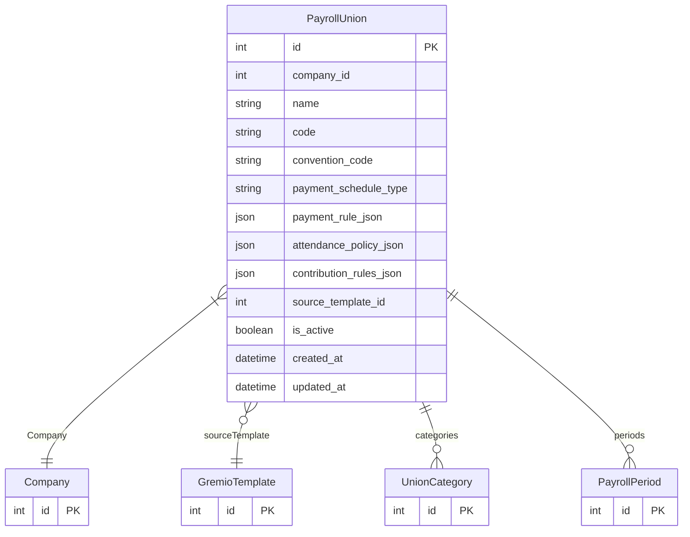

# PayrollUnion

> Table name: `payroll_unions`

**Schema location:** Lines 11987-12021

## Fields

| Field | Type | Required | Unique | Default | Notes |
|-------|------|----------|--------|---------|-------|
| `id` | `Int` | ✅ | 🔑 PK | `autoincrement(` |  |
| `company_id` | `Int` | ✅ |  | `` |  |
| `name` | `String` | ✅ |  | `` | DB: VarChar(100). UOCRA, Comercio, Fuera de Convenio |
| `code` | `String?` | ❌ |  | `` | DB: VarChar(20). Código corto |
| `convention_code` | `String?` | ❌ |  | `` | DB: VarChar(50). Código convenio: 76/75 |
| `payment_schedule_type` | `String` | ✅ |  | `"BIWEEKLY_FIXED"` | DB: VarChar(50). Regla de pago |
| `payment_rule_json` | `Json?` | ❌ |  | `` | BIWEEKLY_FIXED | BIWEEKLY_1_15_16_EOM | MONTHLY_SAME_MONTH | MONTHLY_NEXT_MONTH |
| `attendance_policy_json` | `Json?` | ❌ |  | `` | Política de asistencia del gremio |
| `contribution_rules_json` | `Json?` | ❌ |  | `` | { jubilacion: 11, obraSocial: 3, ... } |
| `source_template_id` | `Int?` | ❌ |  | `` | Origen de plantilla (si fue creado desde una plantilla del sistema) |
| `is_active` | `Boolean` | ✅ |  | `true` |  |
| `created_at` | `DateTime` | ✅ |  | `now(` |  |
| `updated_at` | `DateTime` | ✅ |  | `` |  |

## Relations

| Field | Type | Cardinality | FK Fields | References | On Delete |
|-------|------|-------------|-----------|------------|-----------|
| `Company` | [Company](./models/Company.md) | Many-to-One | company_id | id | Cascade |
| `sourceTemplate` | [GremioTemplate](./models/GremioTemplate.md) | Many-to-One (optional) | source_template_id | id | SetNull |
| `categories` | [UnionCategory](./models/UnionCategory.md) | One-to-Many | - | - | - |
| `periods` | [PayrollPeriod](./models/PayrollPeriod.md) | One-to-Many | - | - | - |

## Referenced By

| Model | Field | Cardinality |
|-------|-------|-------------|
| [Company](./models/Company.md) | `payrollUnions` | Has many |
| [PayrollPeriod](./models/PayrollPeriod.md) | `union` | Has one |
| [GremioTemplate](./models/GremioTemplate.md) | `enabledUnions` | Has many |
| [UnionCategory](./models/UnionCategory.md) | `union` | Has one |

## Indexes

- `company_id`
- `source_template_id`

## Unique Constraints

- `company_id, name`

## Entity Diagram

