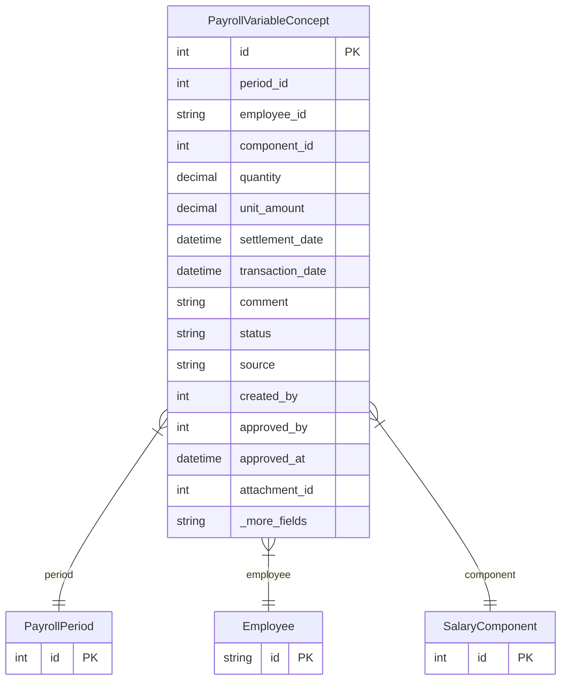

# PayrollVariableConcept

> Table name: `payroll_variable_concepts`

**Schema location:** Lines 12179-12214

## Fields

| Field | Type | Required | Unique | Default | Notes |
|-------|------|----------|--------|---------|-------|
| `id` | `Int` | ✅ | 🔑 PK | `autoincrement(` |  |
| `period_id` | `Int` | ✅ |  | `` |  |
| `employee_id` | `String` | ✅ |  | `` | DB: VarChar(255) |
| `component_id` | `Int` | ✅ |  | `` |  |
| `quantity` | `Decimal` | ✅ |  | `` | DB: Decimal(10, 2). Valores |
| `unit_amount` | `Decimal` | ✅ |  | `` | DB: Decimal(12, 2) |
| `settlement_date` | `DateTime?` | ❌ |  | `` | DB: Date |
| `transaction_date` | `DateTime?` | ❌ |  | `` | DB: Date |
| `comment` | `String?` | ❌ |  | `` | DB: VarChar(500) |
| `status` | `String` | ✅ |  | `"DRAFT"` | DB: VarChar(20). STATUS (permite aprobar antes de liquidar) |
| `source` | `String` | ✅ |  | `"MANUAL"` | DB: VarChar(30). ORIGEN (auditoría) |
| `created_by` | `Int?` | ❌ |  | `` |  |
| `approved_by` | `Int?` | ❌ |  | `` |  |
| `approved_at` | `DateTime?` | ❌ |  | `` |  |
| `attachment_id` | `Int?` | ❌ |  | `` | Si adjunta comprobante |
| `created_at` | `DateTime` | ✅ |  | `now(` |  |

## Relations

| Field | Type | Cardinality | FK Fields | References | On Delete |
|-------|------|-------------|-----------|------------|-----------|
| `period` | [PayrollPeriod](./models/PayrollPeriod.md) | Many-to-One | period_id | id | Cascade |
| `employee` | [Employee](./models/Employee.md) | Many-to-One | employee_id | id | Cascade |
| `component` | [SalaryComponent](./models/SalaryComponent.md) | Many-to-One | component_id | id | Cascade |

## Referenced By

| Model | Field | Cardinality |
|-------|-------|-------------|
| [Employee](./models/Employee.md) | `variableConcepts` | Has many |
| [SalaryComponent](./models/SalaryComponent.md) | `variableConcepts` | Has many |
| [PayrollPeriod](./models/PayrollPeriod.md) | `variableConcepts` | Has many |

## Indexes

- `period_id, employee_id`
- `status`

## Entity Diagram

