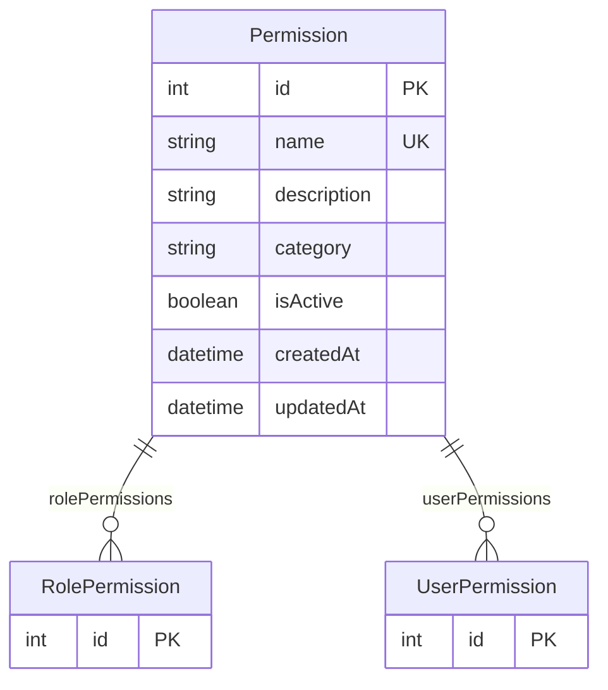

# Permission

> Table name: `Permission`

**Schema location:** Lines 2215-2227

## Fields

| Field | Type | Required | Unique | Default | Notes |
|-------|------|----------|--------|---------|-------|
| `id` | `Int` | ✅ | 🔑 PK | `autoincrement(` |  |
| `name` | `String` | ✅ | ✅ | `` |  |
| `description` | `String?` | ❌ |  | `` |  |
| `category` | `String?` | ❌ |  | `` |  |
| `isActive` | `Boolean` | ✅ |  | `true` |  |
| `createdAt` | `DateTime` | ✅ |  | `now(` |  |
| `updatedAt` | `DateTime` | ✅ |  | `` |  |

## Relations

| Field | Type | Cardinality | FK Fields | References | On Delete |
|-------|------|-------------|-----------|------------|-----------|
| `rolePermissions` | [RolePermission](./models/RolePermission.md) | One-to-Many | - | - | - |
| `userPermissions` | [UserPermission](./models/UserPermission.md) | One-to-Many | - | - | - |

## Referenced By

| Model | Field | Cardinality |
|-------|-------|-------------|
| [RolePermission](./models/RolePermission.md) | `permission` | Has one |
| [UserPermission](./models/UserPermission.md) | `permission` | Has one |

## Entity Diagram

