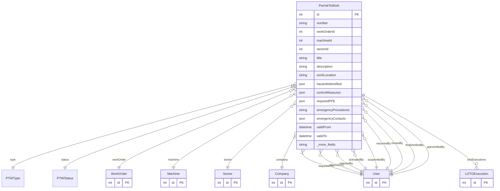

# PermitToWork

> Table name: `permits_to_work`

**Schema location:** Lines 12867-12977

## Fields

| Field | Type | Required | Unique | Default | Notes |
|-------|------|----------|--------|---------|-------|
| `id` | `Int` | ✅ | 🔑 PK | `autoincrement(` |  |
| `number` | `String` | ✅ |  | `` | PTW-2024-0001 |
| `workOrderId` | `Int?` | ❌ |  | `` | Linked entities |
| `machineId` | `Int?` | ❌ |  | `` |  |
| `sectorId` | `Int?` | ❌ |  | `` |  |
| `title` | `String` | ✅ |  | `` | Description of work |
| `description` | `String` | ✅ |  | `` | DB: Text |
| `workLocation` | `String?` | ❌ |  | `` |  |
| `hazardsIdentified` | `Json` | ✅ |  | `"[]"` | Format: [{"hazard": "Fire", "severity": "HIGH", "controls": ["Fire extinguisher nearby"]}] |
| `controlMeasures` | `Json` | ✅ |  | `"[]"` | Format: [{"measure": "Fire watch", "responsible": "John Doe", "verified": true}] |
| `requiredPPE` | `Json` | ✅ |  | `"[]"` | Format: [{"type": "HELMET", "mandatory": true, "specification": "Heat resistant"}] |
| `emergencyProcedures` | `String?` | ❌ |  | `` | Emergency procedures |
| `emergencyContacts` | `Json?` | ❌ |  | `"[]"` |  |
| `validFrom` | `DateTime` | ✅ |  | `` | Validity period |
| `validTo` | `DateTime` | ✅ |  | `` |  |
| `requestedById` | `Int` | ✅ |  | `` | Request flow |
| `requestedAt` | `DateTime` | ✅ |  | `now(` |  |
| `approvedById` | `Int?` | ❌ |  | `` | Approval flow (segregation of duties: requestedBy != approvedBy) |
| `approvedAt` | `DateTime?` | ❌ |  | `` |  |
| `approvalNotes` | `String?` | ❌ |  | `` |  |
| `rejectedById` | `Int?` | ❌ |  | `` | Rejection (if rejected) |
| `rejectedAt` | `DateTime?` | ❌ |  | `` |  |
| `rejectionReason` | `String?` | ❌ |  | `` |  |
| `activatedById` | `Int?` | ❌ |  | `` | Activation (when work starts) |
| `activatedAt` | `DateTime?` | ❌ |  | `` |  |
| `suspendedById` | `Int?` | ❌ |  | `` | Suspension (if temporarily stopped) |
| `suspendedAt` | `DateTime?` | ❌ |  | `` |  |
| `suspensionReason` | `String?` | ❌ |  | `` |  |
| `resumedById` | `Int?` | ❌ |  | `` |  |
| `resumedAt` | `DateTime?` | ❌ |  | `` |  |
| `closedById` | `Int?` | ❌ |  | `` | Closure |
| `closedAt` | `DateTime?` | ❌ |  | `` |  |
| `closeNotes` | `String?` | ❌ |  | `` |  |
| `workCompletedSuccessfully` | `Boolean?` | ❌ |  | `` |  |
| `finalVerificationChecklist` | `Json?` | ❌ |  | `"[]"` | Format: [{"item": "All workers evacuated", "verified": true, "verifiedById": 1}] |
| `finalVerifiedById` | `Int?` | ❌ |  | `` |  |
| `finalVerifiedAt` | `DateTime?` | ❌ |  | `` |  |
| `ppeVerifiedById` | `Int?` | ❌ |  | `` | PPE verification |
| `ppeVerifiedAt` | `DateTime?` | ❌ |  | `` |  |
| `signatures` | `Json?` | ❌ |  | `"[]"` | Format: [{"userId": 1, "role": "REQUESTER", "signedAt": "2024-01-01T00:00:00Z", "ipAddress": "..."}] |
| `attachments` | `Json?` | ❌ |  | `"[]"` | Format: [{"name": "JSA Form", "url": "...", "type": "PDF"}] |
| `companyId` | `Int` | ✅ |  | `` | Metadata |
| `createdAt` | `DateTime` | ✅ |  | `now(` |  |
| `updatedAt` | `DateTime` | ✅ |  | `` |  |

## Relations

| Field | Type | Cardinality | FK Fields | References | On Delete |
|-------|------|-------------|-----------|------------|-----------|
| `type` | [PTWType](./models/PTWType.md) | Many-to-One | - | - | - |
| `status` | [PTWStatus](./models/PTWStatus.md) | Many-to-One | - | - | - |
| `workOrder` | [WorkOrder](./models/WorkOrder.md) | Many-to-One (optional) | workOrderId | id | - |
| `machine` | [Machine](./models/Machine.md) | Many-to-One (optional) | machineId | id | - |
| `sector` | [Sector](./models/Sector.md) | Many-to-One (optional) | sectorId | id | - |
| `company` | [Company](./models/Company.md) | Many-to-One | companyId | id | Cascade |
| `requestedBy` | [User](./models/User.md) | Many-to-One | requestedById | id | - |
| `approvedBy` | [User](./models/User.md) | Many-to-One (optional) | approvedById | id | - |
| `rejectedBy` | [User](./models/User.md) | Many-to-One (optional) | rejectedById | id | - |
| `activatedBy` | [User](./models/User.md) | Many-to-One (optional) | activatedById | id | - |
| `suspendedBy` | [User](./models/User.md) | Many-to-One (optional) | suspendedById | id | - |
| `resumedBy` | [User](./models/User.md) | Many-to-One (optional) | resumedById | id | - |
| `closedBy` | [User](./models/User.md) | Many-to-One (optional) | closedById | id | - |
| `finalVerifiedBy` | [User](./models/User.md) | Many-to-One (optional) | finalVerifiedById | id | - |
| `ppeVerifiedBy` | [User](./models/User.md) | Many-to-One (optional) | ppeVerifiedById | id | - |
| `lotoExecutions` | [LOTOExecution](./models/LOTOExecution.md) | One-to-Many | - | - | - |

## Referenced By

| Model | Field | Cardinality |
|-------|-------|-------------|
| [Company](./models/Company.md) | `permitsToWork` | Has many |
| [User](./models/User.md) | `ptwRequested` | Has many |
| [User](./models/User.md) | `ptwApproved` | Has many |
| [User](./models/User.md) | `ptwRejected` | Has many |
| [User](./models/User.md) | `ptwActivated` | Has many |
| [User](./models/User.md) | `ptwSuspended` | Has many |
| [User](./models/User.md) | `ptwResumed` | Has many |
| [User](./models/User.md) | `ptwClosed` | Has many |
| [User](./models/User.md) | `ptwFinalVerified` | Has many |
| [User](./models/User.md) | `ptwPPEVerified` | Has many |
| [Sector](./models/Sector.md) | `permitsToWork` | Has many |
| [Machine](./models/Machine.md) | `permitsToWork` | Has many |
| [WorkOrder](./models/WorkOrder.md) | `permitsToWork` | Has many |
| [LOTOExecution](./models/LOTOExecution.md) | `ptw` | Has one |

## Indexes

- `status`
- `type`
- `companyId, status`
- `workOrderId`
- `machineId`
- `validTo`

## Unique Constraints

- `number, companyId`

## Entity Diagram

