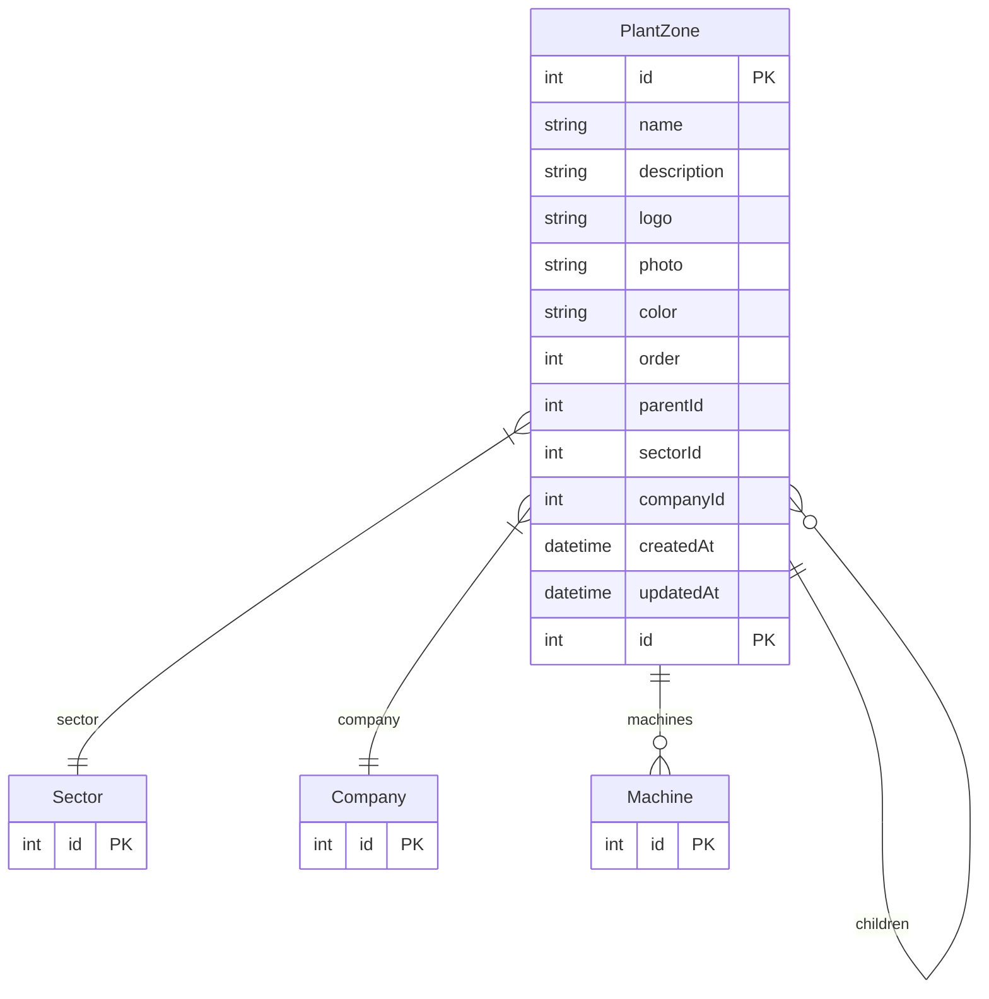

# PlantZone

> Table name: `PlantZone`

**Schema location:** Lines 833-861

## Fields

| Field | Type | Required | Unique | Default | Notes |
|-------|------|----------|--------|---------|-------|
| `id` | `Int` | ✅ | 🔑 PK | `autoincrement(` |  |
| `name` | `String` | ✅ |  | `` |  |
| `description` | `String?` | ❌ |  | `` |  |
| `logo` | `String?` | ❌ |  | `` |  |
| `photo` | `String?` | ❌ |  | `` |  |
| `color` | `String?` | ❌ |  | `` | Color para identificar visualmente |
| `order` | `Int` | ✅ |  | `0` | Orden de visualización |
| `parentId` | `Int?` | ❌ |  | `` | Jerarquía auto-referencial (zonas dentro de zonas, profundidad ilimitada) |
| `sectorId` | `Int` | ✅ |  | `` | Relaciones |
| `companyId` | `Int` | ✅ |  | `` |  |
| `createdAt` | `DateTime` | ✅ |  | `now(` |  |
| `updatedAt` | `DateTime` | ✅ |  | `` |  |

## Relations

| Field | Type | Cardinality | FK Fields | References | On Delete |
|-------|------|-------------|-----------|------------|-----------|
| `parent` | [PlantZone](./models/PlantZone.md) | Many-to-One (optional) | parentId | id | - |
| `children` | [PlantZone](./models/PlantZone.md) | One-to-Many | - | - | - |
| `sector` | [Sector](./models/Sector.md) | Many-to-One | sectorId | id | Cascade |
| `company` | [Company](./models/Company.md) | Many-to-One | companyId | id | Cascade |
| `machines` | [Machine](./models/Machine.md) | One-to-Many | - | - | - |

## Referenced By

| Model | Field | Cardinality |
|-------|-------|-------------|
| [Company](./models/Company.md) | `plantZones` | Has many |
| [Sector](./models/Sector.md) | `plantZones` | Has many |
| [Machine](./models/Machine.md) | `plantZone` | Has one |

## Indexes

- `sectorId`
- `companyId`
- `parentId`

## Entity Diagram

