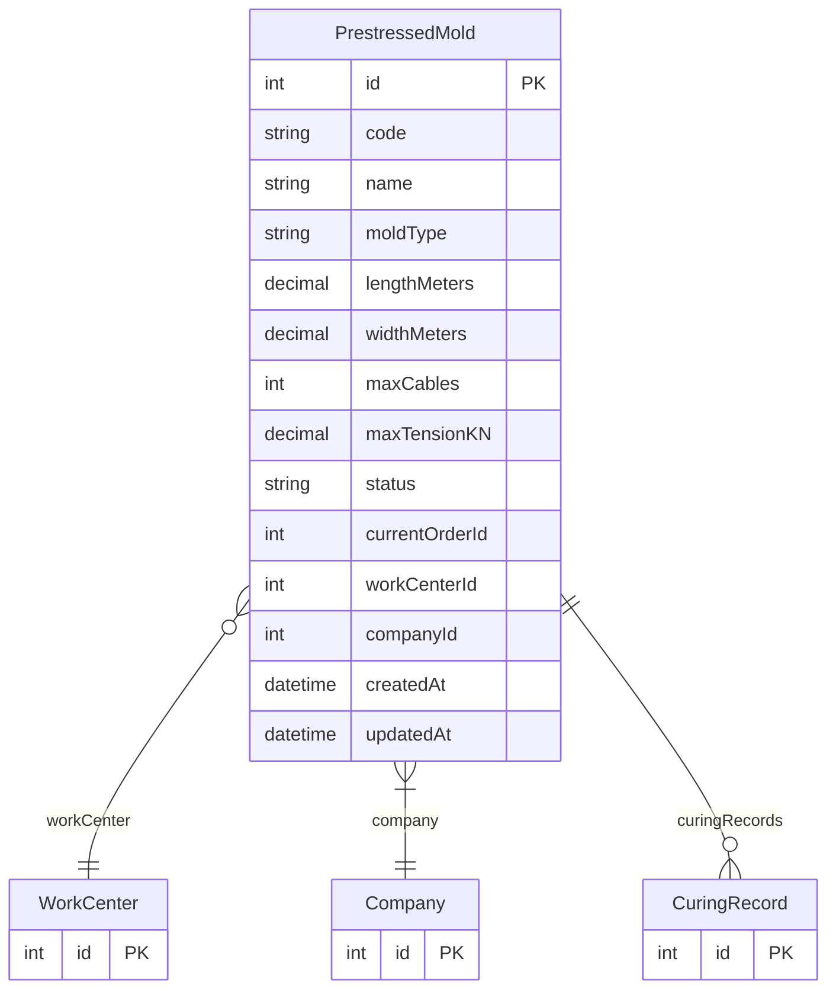

# PrestressedMold

> Table name: `prestressed_molds`

**Schema location:** Lines 14134-14162

## Fields

| Field | Type | Required | Unique | Default | Notes |
|-------|------|----------|--------|---------|-------|
| `id` | `Int` | ✅ | 🔑 PK | `autoincrement(` |  |
| `code` | `String` | ✅ |  | `` |  |
| `name` | `String` | ✅ |  | `` |  |
| `moldType` | `String` | ✅ |  | `` | 'LONG_BED', 'SHORT_BED', 'INDIVIDUAL' |
| `lengthMeters` | `Decimal` | ✅ |  | `` | DB: Decimal(8, 2) |
| `widthMeters` | `Decimal` | ✅ |  | `` | DB: Decimal(8, 2) |
| `maxCables` | `Int` | ✅ |  | `` |  |
| `maxTensionKN` | `Decimal?` | ❌ |  | `` | DB: Decimal(10, 2) |
| `status` | `String` | ✅ |  | `"AVAILABLE"` |  |
| `currentOrderId` | `Int?` | ❌ |  | `` |  |
| `workCenterId` | `Int?` | ❌ |  | `` |  |
| `companyId` | `Int` | ✅ |  | `` |  |
| `createdAt` | `DateTime` | ✅ |  | `now(` |  |
| `updatedAt` | `DateTime` | ✅ |  | `` |  |

## Relations

| Field | Type | Cardinality | FK Fields | References | On Delete |
|-------|------|-------------|-----------|------------|-----------|
| `workCenter` | [WorkCenter](./models/WorkCenter.md) | Many-to-One (optional) | workCenterId | id | - |
| `company` | [Company](./models/Company.md) | Many-to-One | companyId | id | Cascade |
| `curingRecords` | [CuringRecord](./models/CuringRecord.md) | One-to-Many | - | - | - |

## Referenced By

| Model | Field | Cardinality |
|-------|-------|-------------|
| [Company](./models/Company.md) | `prestressedMolds` | Has many |
| [WorkCenter](./models/WorkCenter.md) | `prestressedMolds` | Has many |
| [CuringRecord](./models/CuringRecord.md) | `mold` | Has one |

## Indexes

- `companyId, status`

## Unique Constraints

- `companyId, code`

## Entity Diagram

