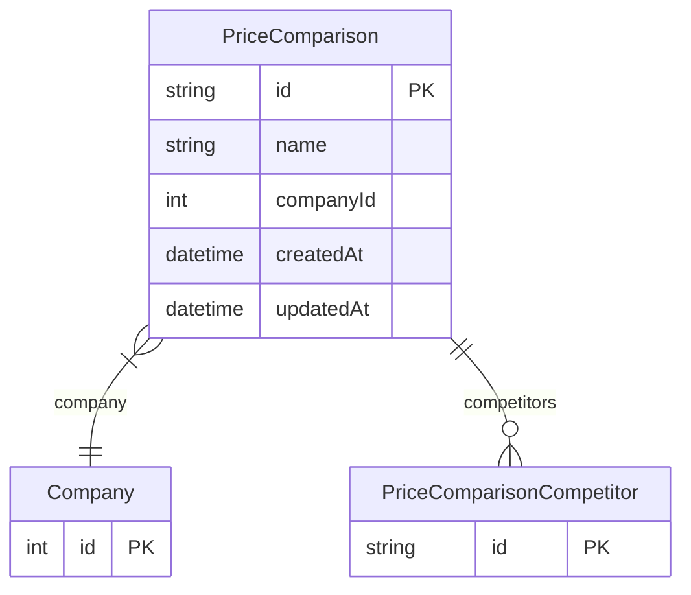

# PriceComparison

> Table name: `PriceComparison`

**Schema location:** Lines 3967-3978

## Fields

| Field | Type | Required | Unique | Default | Notes |
|-------|------|----------|--------|---------|-------|
| `id` | `String` | ✅ | 🔑 PK | `cuid(` |  |
| `name` | `String` | ✅ |  | `` |  |
| `companyId` | `Int` | ✅ |  | `` |  |
| `createdAt` | `DateTime` | ✅ |  | `now(` |  |
| `updatedAt` | `DateTime` | ✅ |  | `` |  |

## Relations

| Field | Type | Cardinality | FK Fields | References | On Delete |
|-------|------|-------------|-----------|------------|-----------|
| `company` | [Company](./models/Company.md) | Many-to-One | companyId | id | Cascade |
| `competitors` | [PriceComparisonCompetitor](./models/PriceComparisonCompetitor.md) | One-to-Many | - | - | - |

## Referenced By

| Model | Field | Cardinality |
|-------|-------|-------------|
| [Company](./models/Company.md) | `priceComparisons` | Has many |
| [PriceComparisonCompetitor](./models/PriceComparisonCompetitor.md) | `comparison` | Has one |

## Indexes

- `companyId`

## Entity Diagram

