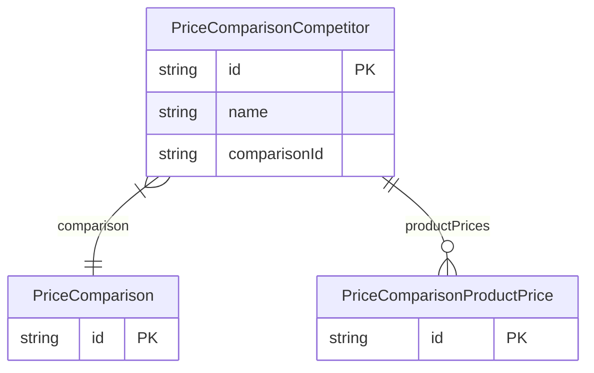

# PriceComparisonCompetitor

> Table name: `PriceComparisonCompetitor`

**Schema location:** Lines 3980-3989

## Fields

| Field | Type | Required | Unique | Default | Notes |
|-------|------|----------|--------|---------|-------|
| `id` | `String` | ✅ | 🔑 PK | `cuid(` |  |
| `name` | `String` | ✅ |  | `` |  |
| `comparisonId` | `String` | ✅ |  | `` |  |

## Relations

| Field | Type | Cardinality | FK Fields | References | On Delete |
|-------|------|-------------|-----------|------------|-----------|
| `comparison` | [PriceComparison](./models/PriceComparison.md) | Many-to-One | comparisonId | id | Cascade |
| `productPrices` | [PriceComparisonProductPrice](./models/PriceComparisonProductPrice.md) | One-to-Many | - | - | - |

## Referenced By

| Model | Field | Cardinality |
|-------|-------|-------------|
| [PriceComparison](./models/PriceComparison.md) | `competitors` | Has many |
| [PriceComparisonProductPrice](./models/PriceComparisonProductPrice.md) | `competitor` | Has one |

## Indexes

- `comparisonId`

## Entity Diagram

