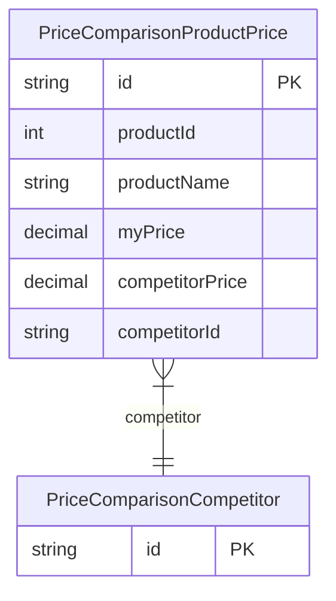

# PriceComparisonProductPrice

> Table name: `PriceComparisonProductPrice`

**Schema location:** Lines 3991-4003

## Fields

| Field | Type | Required | Unique | Default | Notes |
|-------|------|----------|--------|---------|-------|
| `id` | `String` | ✅ | 🔑 PK | `cuid(` |  |
| `productId` | `Int` | ✅ |  | `` |  |
| `productName` | `String` | ✅ |  | `` |  |
| `myPrice` | `Decimal` | ✅ |  | `` | DB: Decimal(15, 2) |
| `competitorPrice` | `Decimal?` | ❌ |  | `` | DB: Decimal(15, 2) |
| `competitorId` | `String` | ✅ |  | `` |  |

## Relations

| Field | Type | Cardinality | FK Fields | References | On Delete |
|-------|------|-------------|-----------|------------|-----------|
| `competitor` | [PriceComparisonCompetitor](./models/PriceComparisonCompetitor.md) | Many-to-One | competitorId | id | Cascade |

## Referenced By

| Model | Field | Cardinality |
|-------|-------|-------------|
| [PriceComparisonCompetitor](./models/PriceComparisonCompetitor.md) | `productPrices` | Has many |

## Indexes

- `competitorId`
- `productId`

## Entity Diagram

