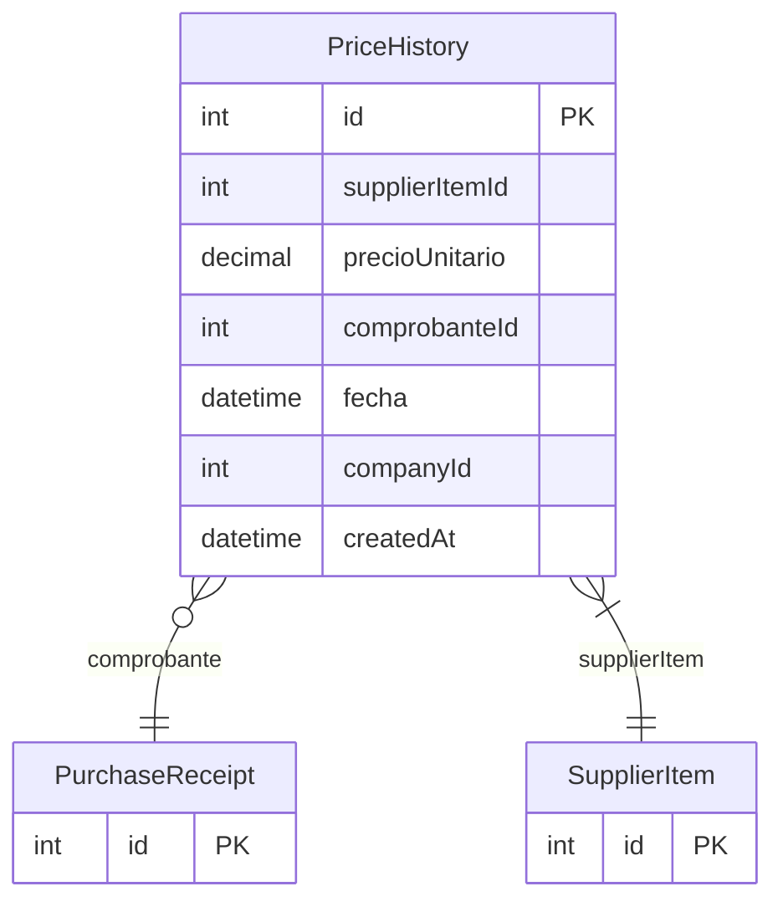

# PriceHistory

> Table name: `PriceHistory`

**Schema location:** Lines 4791-4806

## Fields

| Field | Type | Required | Unique | Default | Notes |
|-------|------|----------|--------|---------|-------|
| `id` | `Int` | ✅ | 🔑 PK | `autoincrement(` |  |
| `supplierItemId` | `Int` | ✅ |  | `` |  |
| `precioUnitario` | `Decimal` | ✅ |  | `` | DB: Decimal(15, 2) |
| `comprobanteId` | `Int?` | ❌ |  | `` |  |
| `fecha` | `DateTime` | ✅ |  | `` | DB: Date |
| `companyId` | `Int` | ✅ |  | `` |  |
| `createdAt` | `DateTime` | ✅ |  | `now(` |  |

## Relations

| Field | Type | Cardinality | FK Fields | References | On Delete |
|-------|------|-------------|-----------|------------|-----------|
| `comprobante` | [PurchaseReceipt](./models/PurchaseReceipt.md) | Many-to-One (optional) | comprobanteId | id | - |
| `supplierItem` | [SupplierItem](./models/SupplierItem.md) | Many-to-One | supplierItemId | id | Cascade |

## Referenced By

| Model | Field | Cardinality |
|-------|-------|-------------|
| [PurchaseReceipt](./models/PurchaseReceipt.md) | `priceHistory` | Has many |
| [SupplierItem](./models/SupplierItem.md) | `priceHistory` | Has many |

## Indexes

- `supplierItemId`
- `fecha`
- `companyId`

## Entity Diagram

