# Product

> Table name: `Product`

**Schema location:** Lines 2304-2407

## Fields

| Field | Type | Required | Unique | Default | Notes |
|-------|------|----------|--------|---------|-------|
| `id` | `String` | ✅ | 🔑 PK | `cuid(` |  |
| `name` | `String` | ✅ |  | `` |  |
| `code` | `String` | ✅ |  | `` |  |
| `description` | `String` | ✅ |  | `` |  |
| `categoryId` | `Int` | ✅ |  | `` |  |
| `unit` | `String` | ✅ |  | `` |  |
| `costPrice` | `Float` | ✅ |  | `` |  |
| `costCurrency` | `String` | ✅ |  | `"ARS"` |  |
| `minStock` | `Int` | ✅ |  | `` |  |
| `currentStock` | `Int` | ✅ |  | `` |  |
| `volume` | `Float` | ✅ |  | `` |  |
| `weight` | `Float` | ✅ |  | `` |  |
| `location` | `String` | ✅ |  | `` |  |
| `blocksPerM2` | `Int?` | ❌ |  | `` |  |
| `isActive` | `Boolean` | ✅ |  | `true` |  |
| `images` | `Json?` | ❌ |  | `` |  |
| `files` | `Json?` | ❌ |  | `` |  |
| `companyId` | `Int` | ✅ |  | `` |  |
| `createdById` | `Int` | ✅ |  | `` |  |
| `createdAt` | `DateTime` | ✅ |  | `now(` |  |
| `updatedAt` | `DateTime` | ✅ |  | `` |  |
| `volumeUnit` | `String?` | ❌ |  | `"metros_lineales"` |  |
| `image` | `String?` | ❌ |  | `` |  |
| `recipeId` | `String?` | ❌ |  | `` | Para productos tipo PRODUCTION |
| `purchaseInputId` | `String?` | ❌ |  | `` | Para productos tipo PURCHASE |
| `weightedAverageCost` | `Float?` | ❌ |  | `` | Costo promedio ponderado (PURCHASE) |
| `lastCostUpdate` | `DateTime?` | ❌ |  | `` | Última actualización de costo |
| `costCalculationStock` | `Int?` | ❌ |  | `0` | Stock usado en último cálculo |
| `salePrice` | `Float?` | ❌ |  | `` | Precio de venta sugerido |
| `saleCurrency` | `String` | ✅ |  | `"ARS"` | Moneda del precio de venta |
| `marginMin` | `Float?` | ❌ |  | `` | Margen mínimo permitido (%) |
| `marginMax` | `Float?` | ❌ |  | `` | Margen máximo permitido (%) |
| `barcode` | `String?` | ❌ |  | `` | Código de barras |
| `sku` | `String?` | ❌ |  | `` | SKU alternativo |
| `tags` | `Json?` | ❌ |  | `` | Array de etiquetas ["premium", "oferta"] |
| `productionSectorId` | `Int?` | ❌ |  | `` | Sector donde se produce este producto |
| `trackBatches` | `Boolean` | ✅ |  | `false` | Seguimiento por lote |
| `trackExpiration` | `Boolean` | ✅ |  | `false` | Control de vencimiento |
| `alertStockEmail` | `Boolean` | ✅ |  | `true` | Alertar por email |
| `alertStockDays` | `Int?` | ❌ |  | `` | Días de anticipación para alertas |

## Relations

| Field | Type | Cardinality | FK Fields | References | On Delete |
|-------|------|-------------|-----------|------------|-----------|
| `costType` | [ProductCostType](./models/ProductCostType.md) | Many-to-One | - | - | - |
| `category` | [Category](./models/Category.md) | Many-to-One | categoryId | id | - |
| `company` | [Company](./models/Company.md) | Many-to-One | companyId | id | Cascade |
| `createdBy` | [User](./models/User.md) | Many-to-One | createdById | id | - |
| `recipe` | [Recipe](./models/Recipe.md) | Many-to-One (optional) | recipeId | id | SetNull |
| `purchaseInput` | [InputItem](./models/InputItem.md) | Many-to-One (optional) | purchaseInputId | id | SetNull |
| `costLogs` | [ProductCostLog](./models/ProductCostLog.md) | One-to-Many | - | - | - |
| `salePriceLogs` | [SalesPriceLog](./models/SalesPriceLog.md) | One-to-Many | - | - | - |
| `quoteItems` | [QuoteItem](./models/QuoteItem.md) | One-to-Many | - | - | - |
| `saleItems` | [SaleItem](./models/SaleItem.md) | One-to-Many | - | - | - |
| `deliveryItems` | [SaleDeliveryItem](./models/SaleDeliveryItem.md) | One-to-Many | - | - | - |
| `loadOrderItems` | [LoadOrderItem](./models/LoadOrderItem.md) | One-to-Many | - | - | - |
| `remitoItems` | [SaleRemitoItem](./models/SaleRemitoItem.md) | One-to-Many | - | - | - |
| `invoiceItems` | [SalesInvoiceItem](./models/SalesInvoiceItem.md) | One-to-Many | - | - | - |
| `creditNoteItems` | [SalesCreditDebitNoteItem](./models/SalesCreditDebitNoteItem.md) | One-to-Many | - | - | - |
| `priceListItems` | [SalesPriceListItem](./models/SalesPriceListItem.md) | One-to-Many | - | - | - |
| `acopioItems` | [SaleAcopioItem](./models/SaleAcopioItem.md) | One-to-Many | - | - | - |
| `discountListProducts` | [DiscountListProduct](./models/DiscountListProduct.md) | One-to-Many | - | - | - |
| `stockMovements` | [ProductStockMovement](./models/ProductStockMovement.md) | One-to-Many | - | - | - |
| `portalOrderItems` | [ClientPortalOrderItem](./models/ClientPortalOrderItem.md) | One-to-Many | - | - | - |
| `rmaItems` | [SaleRMAItem](./models/SaleRMAItem.md) | One-to-Many | - | - | - |
| `warranties` | [ProductWarranty](./models/ProductWarranty.md) | One-to-Many | - | - | - |
| `productionSector` | [Sector](./models/Sector.md) | Many-to-One (optional) | productionSectorId | id | - |
| `dailyProductionEntries` | [DailyProductionEntry](./models/DailyProductionEntry.md) | One-to-Many | - | - | - |

## Referenced By

| Model | Field | Cardinality |
|-------|-------|-------------|
| [Company](./models/Company.md) | `products` | Has many |
| [User](./models/User.md) | `createdProducts` | Has many |
| [Sector](./models/Sector.md) | `productionProducts` | Has many |
| [Category](./models/Category.md) | `products` | Has many |
| [ProductCostLog](./models/ProductCostLog.md) | `product` | Has one |
| [SalesPriceLog](./models/SalesPriceLog.md) | `product` | Has one |
| [ProductStockMovement](./models/ProductStockMovement.md) | `product` | Has one |
| [InputItem](./models/InputItem.md) | `productsUsingPurchase` | Has many |
| [Recipe](./models/Recipe.md) | `productsUsingRecipe` | Has many |
| [DiscountListProduct](./models/DiscountListProduct.md) | `product` | Has one |
| [QuoteItem](./models/QuoteItem.md) | `product` | Has one |
| [ClientPortalOrderItem](./models/ClientPortalOrderItem.md) | `product` | Has one |
| [SaleItem](./models/SaleItem.md) | `product` | Has one |
| [SaleDeliveryItem](./models/SaleDeliveryItem.md) | `product` | Has one |
| [LoadOrderItem](./models/LoadOrderItem.md) | `product` | Has one |
| [SaleRemitoItem](./models/SaleRemitoItem.md) | `product` | Has one |
| [SalesInvoiceItem](./models/SalesInvoiceItem.md) | `product` | Has one |
| [SalesCreditDebitNoteItem](./models/SalesCreditDebitNoteItem.md) | `product` | Has one |
| [SalesPriceListItem](./models/SalesPriceListItem.md) | `product` | Has one |
| [SaleRMAItem](./models/SaleRMAItem.md) | `product` | Has one |
| [ProductWarranty](./models/ProductWarranty.md) | `product` | Has one |
| [SaleAcopioItem](./models/SaleAcopioItem.md) | `product` | Has one |
| [DailyProductionEntry](./models/DailyProductionEntry.md) | `product` | Has one |

## Indexes

- `costType`
- `recipeId`
- `purchaseInputId`
- `barcode`
- `companyId, isActive`
- `productionSectorId`

## Unique Constraints

- `companyId, code`

## Entity Diagram

```mermaid
erDiagram
    Product {
        string id PK
        string name
        string code
        string description
        int categoryId
        string unit
        float costPrice
        string costCurrency
        int minStock
        int currentStock
        float volume
        float weight
        string location
        int blocksPerM2
        boolean isActive
        string _more_fields
    }
    Category {
        int id PK
    }
    Company {
        int id PK
    }
    User {
        int id PK
    }
    Recipe {
        string id PK
    }
    InputItem {
        string id PK
    }
    ProductCostLog {
        string id PK
    }
    SalesPriceLog {
        string id PK
    }
    QuoteItem {
        int id PK
    }
    SaleItem {
        int id PK
    }
    SaleDeliveryItem {
        int id PK
    }
    LoadOrderItem {
        int id PK
    }
    SaleRemitoItem {
        int id PK
    }
    SalesInvoiceItem {
        int id PK
    }
    SalesCreditDebitNoteItem {
        int id PK
    }
    SalesPriceListItem {
        int id PK
    }
    SaleAcopioItem {
        int id PK
    }
    DiscountListProduct {
        string id PK
    }
    ProductStockMovement {
        string id PK
    }
    ClientPortalOrderItem {
        string id PK
    }
    SaleRMAItem {
        int id PK
    }
    ProductWarranty {
        string id PK
    }
    Sector {
        int id PK
    }
    DailyProductionEntry {
        int id PK
    }
    Product }|--|| ProductCostType : "costType"
    Product }|--|| Category : "category"
    Product }|--|| Company : "company"
    Product }|--|| User : "createdBy"
    Product }o--|| Recipe : "recipe"
    Product }o--|| InputItem : "purchaseInput"
    Product ||--o{ ProductCostLog : "costLogs"
    Product ||--o{ SalesPriceLog : "salePriceLogs"
    Product ||--o{ QuoteItem : "quoteItems"
    Product ||--o{ SaleItem : "saleItems"
    Product ||--o{ SaleDeliveryItem : "deliveryItems"
    Product ||--o{ LoadOrderItem : "loadOrderItems"
    Product ||--o{ SaleRemitoItem : "remitoItems"
    Product ||--o{ SalesInvoiceItem : "invoiceItems"
    Product ||--o{ SalesCreditDebitNoteItem : "creditNoteItems"
    Product ||--o{ SalesPriceListItem : "priceListItems"
    Product ||--o{ SaleAcopioItem : "acopioItems"
    Product ||--o{ DiscountListProduct : "discountListProducts"
    Product ||--o{ ProductStockMovement : "stockMovements"
    Product ||--o{ ClientPortalOrderItem : "portalOrderItems"
    Product ||--o{ SaleRMAItem : "rmaItems"
    Product ||--o{ ProductWarranty : "warranties"
    Product }o--|| Sector : "productionSector"
    Product ||--o{ DailyProductionEntry : "dailyProductionEntries"
```

