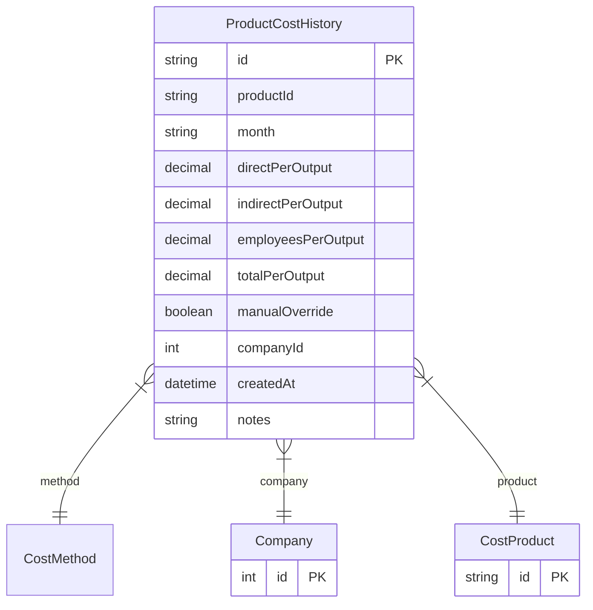

# ProductCostHistory

> Table name: `ProductCostHistory`

**Schema location:** Lines 2892-2910

## Fields

| Field | Type | Required | Unique | Default | Notes |
|-------|------|----------|--------|---------|-------|
| `id` | `String` | ✅ | 🔑 PK | `uuid(` |  |
| `productId` | `String` | ✅ |  | `` |  |
| `month` | `String` | ✅ |  | `` |  |
| `directPerOutput` | `Decimal` | ✅ |  | `` | DB: Decimal(12, 4) |
| `indirectPerOutput` | `Decimal` | ✅ |  | `` | DB: Decimal(12, 4) |
| `employeesPerOutput` | `Decimal` | ✅ |  | `` | DB: Decimal(12, 4) |
| `totalPerOutput` | `Decimal` | ✅ |  | `` | DB: Decimal(12, 4) |
| `manualOverride` | `Boolean` | ✅ |  | `false` |  |
| `companyId` | `Int` | ✅ |  | `` |  |
| `createdAt` | `DateTime` | ✅ |  | `now(` |  |
| `notes` | `String?` | ❌ |  | `` |  |

## Relations

| Field | Type | Cardinality | FK Fields | References | On Delete |
|-------|------|-------------|-----------|------------|-----------|
| `method` | [CostMethod](./models/CostMethod.md) | Many-to-One | - | - | - |
| `company` | [Company](./models/Company.md) | Many-to-One | companyId | id | Cascade |
| `product` | [CostProduct](./models/CostProduct.md) | Many-to-One | productId | id | Cascade |

## Referenced By

| Model | Field | Cardinality |
|-------|-------|-------------|
| [Company](./models/Company.md) | `productCostHistories` | Has many |
| [CostProduct](./models/CostProduct.md) | `costHistory` | Has many |

## Unique Constraints

- `productId, month, method`

## Entity Diagram

