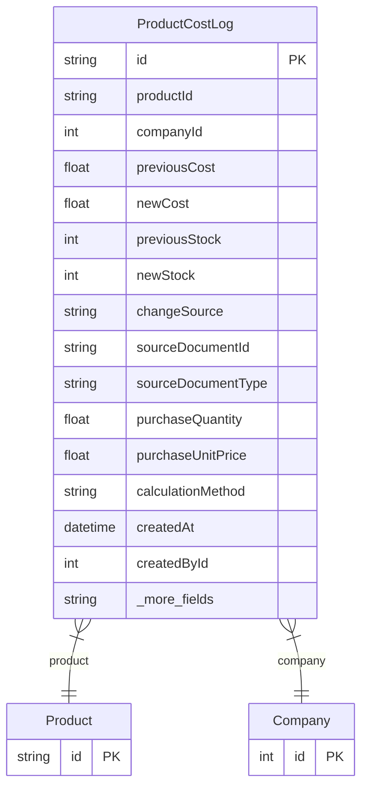

# ProductCostLog

> Table name: `ProductCostLog`

**Schema location:** Lines 2410-2443

## Fields

| Field | Type | Required | Unique | Default | Notes |
|-------|------|----------|--------|---------|-------|
| `id` | `String` | ✅ | 🔑 PK | `cuid(` |  |
| `productId` | `String` | ✅ |  | `` |  |
| `companyId` | `Int` | ✅ |  | `` |  |
| `previousCost` | `Float?` | ❌ |  | `` | Valores del cambio |
| `newCost` | `Float` | ✅ |  | `` |  |
| `previousStock` | `Int?` | ❌ |  | `` |  |
| `newStock` | `Int?` | ❌ |  | `` |  |
| `changeSource` | `String` | ✅ |  | `` | 'PURCHASE', 'RECIPE_UPDATE', 'MANUAL', 'BATCH_RUN' |
| `sourceDocumentId` | `String?` | ❌ |  | `` | ID del documento origen |
| `sourceDocumentType` | `String?` | ❌ |  | `` | Tipo de documento |
| `purchaseQuantity` | `Float?` | ❌ |  | `` | Cálculo detallado (para auditoría) |
| `purchaseUnitPrice` | `Float?` | ❌ |  | `` |  |
| `calculationMethod` | `String?` | ❌ |  | `` | 'WEIGHTED_AVERAGE', 'LAST_PURCHASE', 'RECIPE_SUM' |
| `createdAt` | `DateTime` | ✅ |  | `now(` | Metadata |
| `createdById` | `Int?` | ❌ |  | `` |  |
| `notes` | `String?` | ❌ |  | `` |  |

## Relations

| Field | Type | Cardinality | FK Fields | References | On Delete |
|-------|------|-------------|-----------|------------|-----------|
| `product` | [Product](./models/Product.md) | Many-to-One | productId | id | Cascade |
| `company` | [Company](./models/Company.md) | Many-to-One | companyId | id | Cascade |

## Referenced By

| Model | Field | Cardinality |
|-------|-------|-------------|
| [Company](./models/Company.md) | `productCostLogs` | Has many |
| [Product](./models/Product.md) | `costLogs` | Has many |

## Indexes

- `productId`
- `companyId, createdAt(sort: Desc)`
- `changeSource`

## Entity Diagram

