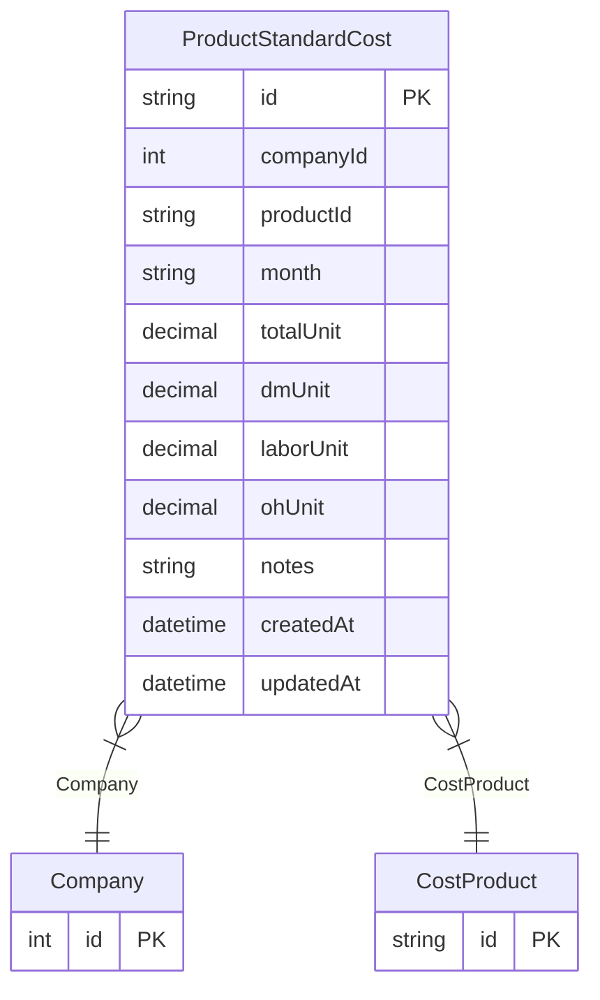

# ProductStandardCost

**Schema location:** Lines 3057-3073

## Fields

| Field | Type | Required | Unique | Default | Notes |
|-------|------|----------|--------|---------|-------|
| `id` | `String` | ✅ | 🔑 PK | `` |  |
| `companyId` | `Int` | ✅ |  | `` |  |
| `productId` | `String` | ✅ |  | `` |  |
| `month` | `String` | ✅ |  | `` |  |
| `totalUnit` | `Decimal` | ✅ |  | `` | DB: Decimal(12, 4) |
| `dmUnit` | `Decimal` | ✅ |  | `` | DB: Decimal(12, 4) |
| `laborUnit` | `Decimal?` | ❌ |  | `` | DB: Decimal(12, 4) |
| `ohUnit` | `Decimal?` | ❌ |  | `` | DB: Decimal(12, 4) |
| `notes` | `String?` | ❌ |  | `` |  |
| `createdAt` | `DateTime` | ✅ |  | `now(` |  |
| `updatedAt` | `DateTime` | ✅ |  | `` |  |

## Relations

| Field | Type | Cardinality | FK Fields | References | On Delete |
|-------|------|-------------|-----------|------------|-----------|
| `Company` | [Company](./models/Company.md) | Many-to-One | companyId | id | Cascade |
| `CostProduct` | [CostProduct](./models/CostProduct.md) | Many-to-One | productId | id | Cascade |

## Referenced By

| Model | Field | Cardinality |
|-------|-------|-------------|
| [Company](./models/Company.md) | `ProductStandardCost` | Has many |
| [CostProduct](./models/CostProduct.md) | `ProductStandardCost` | Has many |

## Unique Constraints

- `productId, month`

## Entity Diagram

