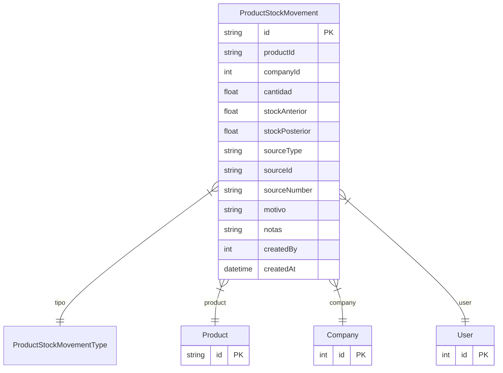

# ProductStockMovement

> Table name: `product_stock_movements`

**Schema location:** Lines 2477-2505

## Fields

| Field | Type | Required | Unique | Default | Notes |
|-------|------|----------|--------|---------|-------|
| `id` | `String` | ✅ | 🔑 PK | `cuid(` |  |
| `productId` | `String` | ✅ |  | `` |  |
| `companyId` | `Int` | ✅ |  | `` |  |
| `cantidad` | `Float` | ✅ |  | `` |  |
| `stockAnterior` | `Float` | ✅ |  | `` |  |
| `stockPosterior` | `Float` | ✅ |  | `` |  |
| `sourceType` | `String?` | ❌ |  | `` | 'SALE', 'RETURN', 'ADJUSTMENT', 'PRODUCTION', 'MANUAL' |
| `sourceId` | `String?` | ❌ |  | `` | ID del documento origen |
| `sourceNumber` | `String?` | ❌ |  | `` | Número visible (OV-2024-001) |
| `motivo` | `String?` | ❌ |  | `` |  |
| `notas` | `String?` | ❌ |  | `` |  |
| `createdBy` | `Int` | ✅ |  | `` |  |
| `createdAt` | `DateTime` | ✅ |  | `now(` |  |

## Relations

| Field | Type | Cardinality | FK Fields | References | On Delete |
|-------|------|-------------|-----------|------------|-----------|
| `tipo` | [ProductStockMovementType](./models/ProductStockMovementType.md) | Many-to-One | - | - | - |
| `product` | [Product](./models/Product.md) | Many-to-One | productId | id | Cascade |
| `company` | [Company](./models/Company.md) | Many-to-One | companyId | id | Cascade |
| `user` | [User](./models/User.md) | Many-to-One | createdBy | id | - |

## Referenced By

| Model | Field | Cardinality |
|-------|-------|-------------|
| [Company](./models/Company.md) | `productStockMovements` | Has many |
| [User](./models/User.md) | `productStockMovements` | Has many |
| [Product](./models/Product.md) | `stockMovements` | Has many |

## Indexes

- `productId`
- `companyId, createdAt(sort: Desc)`

## Entity Diagram

