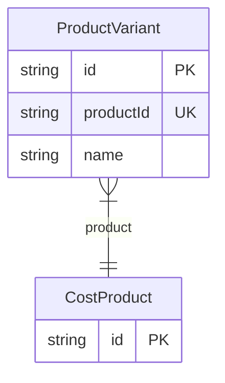

# ProductVariant

> Table name: `ProductVariant`

**Schema location:** Lines 2638-2645

## Fields

| Field | Type | Required | Unique | Default | Notes |
|-------|------|----------|--------|---------|-------|
| `id` | `String` | ✅ | 🔑 PK | `uuid(` |  |
| `productId` | `String` | ✅ | ✅ | `` |  |
| `name` | `String?` | ❌ |  | `` |  |

## Relations

| Field | Type | Cardinality | FK Fields | References | On Delete |
|-------|------|-------------|-----------|------------|-----------|
| `product` | [CostProduct](./models/CostProduct.md) | Many-to-One | productId | id | Cascade |

## Referenced By

| Model | Field | Cardinality |
|-------|-------|-------------|
| [CostProduct](./models/CostProduct.md) | `variant` | Has one |

## Entity Diagram

