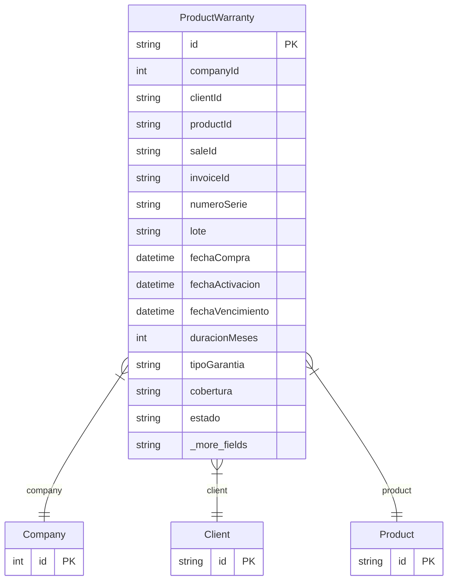

# ProductWarranty

> Table name: `product_warranties`

**Schema location:** Lines 10221-10261

## Fields

| Field | Type | Required | Unique | Default | Notes |
|-------|------|----------|--------|---------|-------|
| `id` | `String` | ✅ | 🔑 PK | `cuid(` |  |
| `companyId` | `Int` | ✅ |  | `` |  |
| `clientId` | `String` | ✅ |  | `` |  |
| `productId` | `String` | ✅ |  | `` |  |
| `saleId` | `String?` | ❌ |  | `` |  |
| `invoiceId` | `String?` | ❌ |  | `` |  |
| `numeroSerie` | `String?` | ❌ |  | `` |  |
| `lote` | `String?` | ❌ |  | `` |  |
| `fechaCompra` | `DateTime` | ✅ |  | `` |  |
| `fechaActivacion` | `DateTime?` | ❌ |  | `` |  |
| `fechaVencimiento` | `DateTime` | ✅ |  | `` |  |
| `duracionMeses` | `Int` | ✅ |  | `` | Duración en meses |
| `tipoGarantia` | `String` | ✅ |  | `` | FABRICANTE, EXTENDIDA, COMERCIAL |
| `cobertura` | `String` | ✅ |  | `` | DB: Text. Descripción de cobertura |
| `estado` | `String` | ✅ |  | `"ACTIVA"` | ACTIVA, VENCIDA, UTILIZADA, CANCELADA |
| `rmaId` | `String?` | ❌ |  | `` | Si se utilizó la garantía |
| `fechaReclamo` | `DateTime?` | ❌ |  | `` |  |
| `motivoReclamo` | `String?` | ❌ |  | `` | DB: Text |
| `resolucion` | `String?` | ❌ |  | `` | DB: Text |
| `createdAt` | `DateTime` | ✅ |  | `now(` |  |
| `updatedAt` | `DateTime` | ✅ |  | `` |  |

## Relations

| Field | Type | Cardinality | FK Fields | References | On Delete |
|-------|------|-------------|-----------|------------|-----------|
| `company` | [Company](./models/Company.md) | Many-to-One | companyId | id | Cascade |
| `client` | [Client](./models/Client.md) | Many-to-One | clientId | id | - |
| `product` | [Product](./models/Product.md) | Many-to-One | productId | id | - |

## Referenced By

| Model | Field | Cardinality |
|-------|-------|-------------|
| [Company](./models/Company.md) | `warranties` | Has many |
| [Product](./models/Product.md) | `warranties` | Has many |
| [Client](./models/Client.md) | `warranties` | Has many |

## Indexes

- `companyId`
- `clientId`
- `productId`
- `fechaVencimiento`
- `estado`

## Entity Diagram

