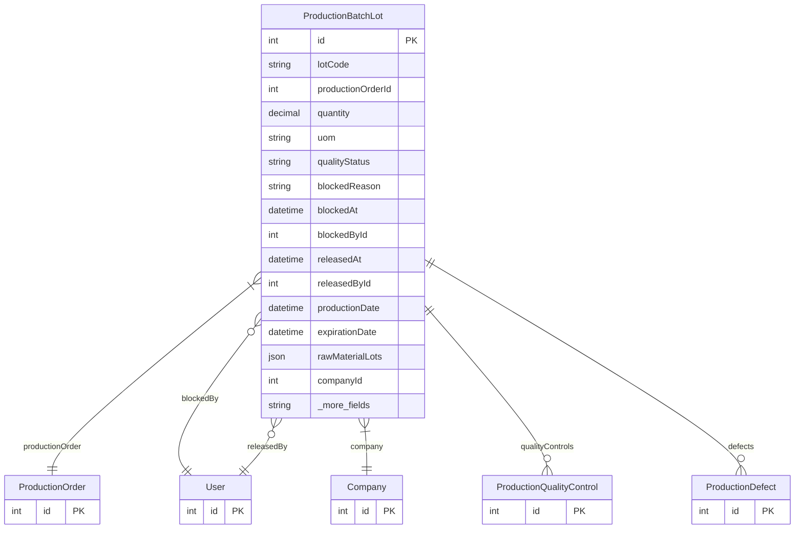

# ProductionBatchLot

> Table name: `production_batch_lots`

**Schema location:** Lines 13842-13886

## Fields

| Field | Type | Required | Unique | Default | Notes |
|-------|------|----------|--------|---------|-------|
| `id` | `Int` | ✅ | 🔑 PK | `autoincrement(` |  |
| `lotCode` | `String` | ✅ |  | `` | "L-2025-01-001" |
| `productionOrderId` | `Int` | ✅ |  | `` |  |
| `quantity` | `Decimal` | ✅ |  | `` | DB: Decimal(12, 4) |
| `uom` | `String` | ✅ |  | `` |  |
| `qualityStatus` | `String` | ✅ |  | `"PENDING"` | Estado |
| `blockedReason` | `String?` | ❌ |  | `` | Bloqueo |
| `blockedAt` | `DateTime?` | ❌ |  | `` |  |
| `blockedById` | `Int?` | ❌ |  | `` |  |
| `releasedAt` | `DateTime?` | ❌ |  | `` | Liberación |
| `releasedById` | `Int?` | ❌ |  | `` |  |
| `productionDate` | `DateTime` | ✅ |  | `` | Trazabilidad básica |
| `expirationDate` | `DateTime?` | ❌ |  | `` |  |
| `rawMaterialLots` | `Json?` | ❌ |  | `` | [{inputId, lotNumber, quantity}] |
| `companyId` | `Int` | ✅ |  | `` |  |
| `createdAt` | `DateTime` | ✅ |  | `now(` |  |
| `updatedAt` | `DateTime` | ✅ |  | `` |  |

## Relations

| Field | Type | Cardinality | FK Fields | References | On Delete |
|-------|------|-------------|-----------|------------|-----------|
| `productionOrder` | [ProductionOrder](./models/ProductionOrder.md) | Many-to-One | productionOrderId | id | - |
| `blockedBy` | [User](./models/User.md) | Many-to-One (optional) | blockedById | id | - |
| `releasedBy` | [User](./models/User.md) | Many-to-One (optional) | releasedById | id | - |
| `company` | [Company](./models/Company.md) | Many-to-One | companyId | id | Cascade |
| `qualityControls` | [ProductionQualityControl](./models/ProductionQualityControl.md) | One-to-Many | - | - | - |
| `defects` | [ProductionDefect](./models/ProductionDefect.md) | One-to-Many | - | - | - |

## Referenced By

| Model | Field | Cardinality |
|-------|-------|-------------|
| [Company](./models/Company.md) | `productionBatchLots` | Has many |
| [User](./models/User.md) | `productionLotsBlocked` | Has many |
| [User](./models/User.md) | `productionLotsReleased` | Has many |
| [ProductionOrder](./models/ProductionOrder.md) | `batchLots` | Has many |
| [ProductionQualityControl](./models/ProductionQualityControl.md) | `batchLot` | Has one |
| [ProductionDefect](./models/ProductionDefect.md) | `batchLot` | Has one |

## Indexes

- `qualityStatus`
- `productionOrderId`

## Unique Constraints

- `companyId, lotCode`

## Entity Diagram

