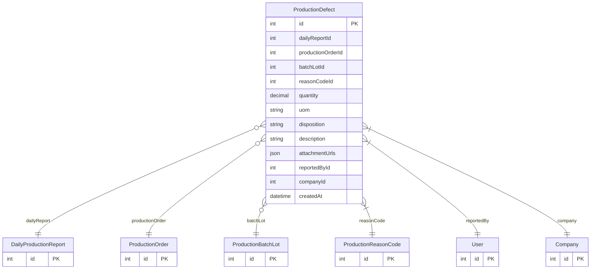

# ProductionDefect

> Table name: `production_defects`

**Schema location:** Lines 13804-13839

## Fields

| Field | Type | Required | Unique | Default | Notes |
|-------|------|----------|--------|---------|-------|
| `id` | `Int` | ✅ | 🔑 PK | `autoincrement(` |  |
| `dailyReportId` | `Int?` | ❌ |  | `` | Contexto |
| `productionOrderId` | `Int?` | ❌ |  | `` |  |
| `batchLotId` | `Int?` | ❌ |  | `` |  |
| `reasonCodeId` | `Int` | ✅ |  | `` | Reason Code de tipo SCRAP |
| `quantity` | `Decimal` | ✅ |  | `` | DB: Decimal(12, 4) |
| `uom` | `String` | ✅ |  | `` |  |
| `disposition` | `String` | ✅ |  | `"SCRAP"` | 'SCRAP', 'REWORK', 'DOWNGRADE' |
| `description` | `String?` | ❌ |  | `` | Detalle |
| `attachmentUrls` | `Json?` | ❌ |  | `` |  |
| `reportedById` | `Int` | ✅ |  | `` |  |
| `companyId` | `Int` | ✅ |  | `` |  |
| `createdAt` | `DateTime` | ✅ |  | `now(` |  |

## Relations

| Field | Type | Cardinality | FK Fields | References | On Delete |
|-------|------|-------------|-----------|------------|-----------|
| `dailyReport` | [DailyProductionReport](./models/DailyProductionReport.md) | Many-to-One (optional) | dailyReportId | id | - |
| `productionOrder` | [ProductionOrder](./models/ProductionOrder.md) | Many-to-One (optional) | productionOrderId | id | - |
| `batchLot` | [ProductionBatchLot](./models/ProductionBatchLot.md) | Many-to-One (optional) | batchLotId | id | - |
| `reasonCode` | [ProductionReasonCode](./models/ProductionReasonCode.md) | Many-to-One | reasonCodeId | id | - |
| `reportedBy` | [User](./models/User.md) | Many-to-One | reportedById | id | - |
| `company` | [Company](./models/Company.md) | Many-to-One | companyId | id | Cascade |

## Referenced By

| Model | Field | Cardinality |
|-------|-------|-------------|
| [Company](./models/Company.md) | `productionDefects` | Has many |
| [User](./models/User.md) | `productionDefectsReported` | Has many |
| [ProductionReasonCode](./models/ProductionReasonCode.md) | `defects` | Has many |
| [ProductionOrder](./models/ProductionOrder.md) | `defects` | Has many |
| [DailyProductionReport](./models/DailyProductionReport.md) | `defects` | Has many |
| [ProductionBatchLot](./models/ProductionBatchLot.md) | `defects` | Has many |

## Indexes

- `productionOrderId`
- `reasonCodeId`

## Entity Diagram

