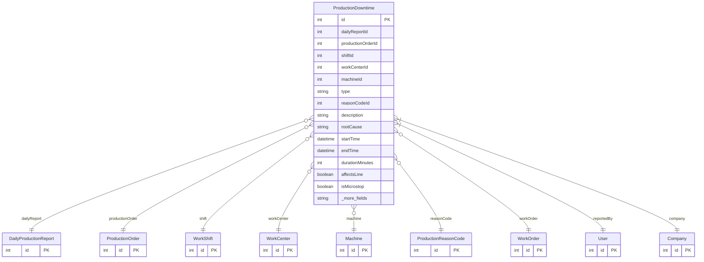

# ProductionDowntime

> Table name: `production_downtimes`

**Schema location:** Lines 13693-13757

## Fields

| Field | Type | Required | Unique | Default | Notes |
|-------|------|----------|--------|---------|-------|
| `id` | `Int` | ✅ | 🔑 PK | `autoincrement(` |  |
| `dailyReportId` | `Int?` | ❌ |  | `` | Contexto |
| `productionOrderId` | `Int?` | ❌ |  | `` |  |
| `shiftId` | `Int?` | ❌ |  | `` |  |
| `workCenterId` | `Int?` | ❌ |  | `` |  |
| `machineId` | `Int?` | ❌ |  | `` | Si es específico de una máquina |
| `type` | `String` | ✅ |  | `` | 'PLANNED', 'UNPLANNED' |
| `reasonCodeId` | `Int?` | ❌ |  | `` |  |
| `description` | `String` | ✅ |  | `` | Detalle |
| `rootCause` | `String?` | ❌ |  | `` |  |
| `startTime` | `DateTime` | ✅ |  | `` | Tiempos |
| `endTime` | `DateTime?` | ❌ |  | `` |  |
| `durationMinutes` | `Int?` | ❌ |  | `` | Calculado o manual |
| `affectsLine` | `Boolean` | ✅ |  | `true` | Paro total vs parcial |
| `isMicrostop` | `Boolean` | ✅ |  | `false` | PRO: <5 min |
| `detectedBy` | `String` | ✅ |  | `"MANUAL"` | 'MANUAL', 'SUPERVISOR', 'SENSOR' |
| `workOrderId` | `Int?` | ❌ |  | `` | Vinculación Mantenimiento |
| `failureOccurrenceId` | `Int?` | ❌ |  | `` |  |
| `qualityHoldId` | `Int?` | ❌ |  | `` | Si derivó en retención de lote |
| `reportedById` | `Int` | ✅ |  | `` | Reportado por |
| `offlineId` | `String?` | ❌ |  | `` | Offline |
| `syncedAt` | `DateTime?` | ❌ |  | `` |  |
| `companyId` | `Int` | ✅ |  | `` |  |
| `createdAt` | `DateTime` | ✅ |  | `now(` |  |
| `updatedAt` | `DateTime` | ✅ |  | `` |  |

## Relations

| Field | Type | Cardinality | FK Fields | References | On Delete |
|-------|------|-------------|-----------|------------|-----------|
| `dailyReport` | [DailyProductionReport](./models/DailyProductionReport.md) | Many-to-One (optional) | dailyReportId | id | - |
| `productionOrder` | [ProductionOrder](./models/ProductionOrder.md) | Many-to-One (optional) | productionOrderId | id | - |
| `shift` | [WorkShift](./models/WorkShift.md) | Many-to-One (optional) | shiftId | id | - |
| `workCenter` | [WorkCenter](./models/WorkCenter.md) | Many-to-One (optional) | workCenterId | id | - |
| `machine` | [Machine](./models/Machine.md) | Many-to-One (optional) | machineId | id | - |
| `reasonCode` | [ProductionReasonCode](./models/ProductionReasonCode.md) | Many-to-One (optional) | reasonCodeId | id | - |
| `workOrder` | [WorkOrder](./models/WorkOrder.md) | Many-to-One (optional) | workOrderId | id | - |
| `reportedBy` | [User](./models/User.md) | Many-to-One | reportedById | id | - |
| `company` | [Company](./models/Company.md) | Many-to-One | companyId | id | Cascade |

## Referenced By

| Model | Field | Cardinality |
|-------|-------|-------------|
| [Company](./models/Company.md) | `productionDowntimes` | Has many |
| [User](./models/User.md) | `productionDowntimesReported` | Has many |
| [Machine](./models/Machine.md) | `productionDowntimes` | Has many |
| [WorkOrder](./models/WorkOrder.md) | `productionDowntimes` | Has many |
| [WorkShift](./models/WorkShift.md) | `downtimes` | Has many |
| [WorkCenter](./models/WorkCenter.md) | `downtimes` | Has many |
| [ProductionReasonCode](./models/ProductionReasonCode.md) | `downtimes` | Has many |
| [ProductionOrder](./models/ProductionOrder.md) | `downtimes` | Has many |
| [DailyProductionReport](./models/DailyProductionReport.md) | `downtimes` | Has many |

## Indexes

- `companyId, startTime`
- `reasonCodeId`
- `workOrderId`
- `machineId, startTime`

## Unique Constraints

- `companyId, offlineId`

## Entity Diagram

