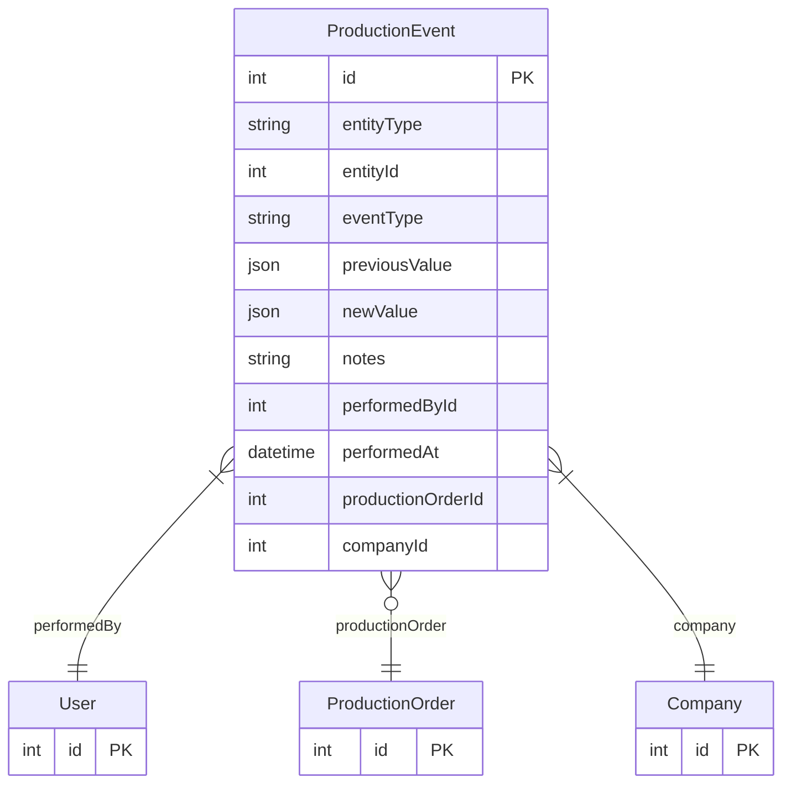

# ProductionEvent

> Table name: `production_events`

**Schema location:** Lines 13889-13925

## Fields

| Field | Type | Required | Unique | Default | Notes |
|-------|------|----------|--------|---------|-------|
| `id` | `Int` | ✅ | 🔑 PK | `autoincrement(` |  |
| `entityType` | `String` | ✅ |  | `` | 'PRODUCTION_ORDER', 'DAILY_REPORT', 'BATCH_LOT', etc. |
| `entityId` | `Int` | ✅ |  | `` |  |
| `eventType` | `String` | ✅ |  | `` | Evento |
| `previousValue` | `Json?` | ❌ |  | `` | Detalle |
| `newValue` | `Json?` | ❌ |  | `` |  |
| `notes` | `String?` | ❌ |  | `` |  |
| `performedById` | `Int` | ✅ |  | `` | Quién y cuándo |
| `performedAt` | `DateTime` | ✅ |  | `now(` |  |
| `productionOrderId` | `Int?` | ❌ |  | `` | Contexto |
| `companyId` | `Int` | ✅ |  | `` |  |

## Relations

| Field | Type | Cardinality | FK Fields | References | On Delete |
|-------|------|-------------|-----------|------------|-----------|
| `performedBy` | [User](./models/User.md) | Many-to-One | performedById | id | - |
| `productionOrder` | [ProductionOrder](./models/ProductionOrder.md) | Many-to-One (optional) | productionOrderId | id | - |
| `company` | [Company](./models/Company.md) | Many-to-One | companyId | id | Cascade |

## Referenced By

| Model | Field | Cardinality |
|-------|-------|-------------|
| [Company](./models/Company.md) | `productionEvents` | Has many |
| [User](./models/User.md) | `productionEventsPerformed` | Has many |
| [ProductionOrder](./models/ProductionOrder.md) | `events` | Has many |

## Indexes

- `entityType, entityId`
- `productionOrderId`
- `performedAt`

## Entity Diagram

